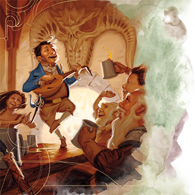

# Criminal

You eked out a living in dark alleyways, cutting purses or burgling shops. Perhaps you were part of a small gang of like-minded wrongdoers who looked out for each other. Or maybe you were a lone wolf, fending for yourself against the local thieves’ guild and more fearsome lawbreakers.

-
**Ability Scores:**Dexterity, Constitution, Intelligence -
**Feat:**Alert

-
**Skill Proficiencies:**Sleight of Hand and Stealth -
**Tool Proficiencies:**Thieves’ Tools -
**Equipment:***Choose A or B:*(A) 2 Daggers, Thieves’ Tools, Crowbar, 2 Pouches, Traveler’s Clothes, 16 GP; or (B) 50 GP

