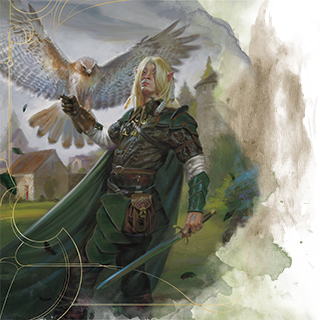

# Boon of Fate

*Epic Boon Feat (Prerequisite: Level 19+)*

You gain the following benefits.

* **Ability Score Increase.** Increase one ability score of your choice by 1, to a maximum of 30.

* Improve Fate. *When you or another creature within 60 feet of you succeeds on or fails a D20 Test, you can roll 2d4 and apply the total rolled as a bonus or penalty to the d20 roll. Once you use this benefit, you can’t use it again until you roll Initiative or finish a Short or Long Rest.

