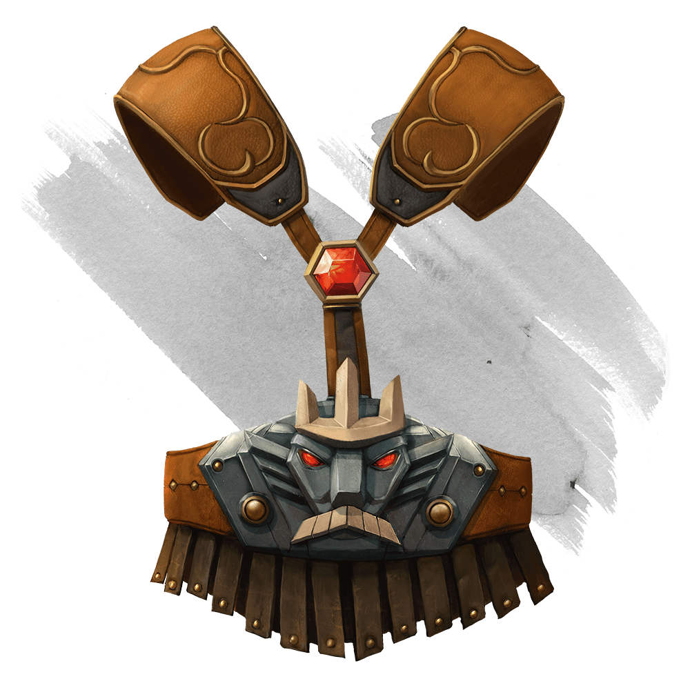

# Belt of Giant Strength

Wondrous Item, varies (requires attunement)

While wearing this belt, your Strength score changes to a score granted by the belt. The item has no effect on you if your Strength without the belt is equal to or greater than the belt’s score.

Six varieties of this belt exist, corresponding with and having rarity according to the six kinds of true giants. The belt of stone giant strength and the belt of frost giant strength look different, but they have the same effect.

| Type | Strength | Rarity |
|---|---|---|
| Belt of Hill Giant Strength | 21 | Rare |
| Belt of Frost Giant Strength | 23 | Very Rare |
| Belt of Stone Giant Strength | 23 | Very Rare |
| Belt of Fire Giant Strength | 25 | Very Rare |
| Belt of Cloud Giant Strength | 27 | Legendary |
| Belt of Storm Giant Strength | 29 | Legendary |

Notes: Set: Strength Score, Buff, Belt