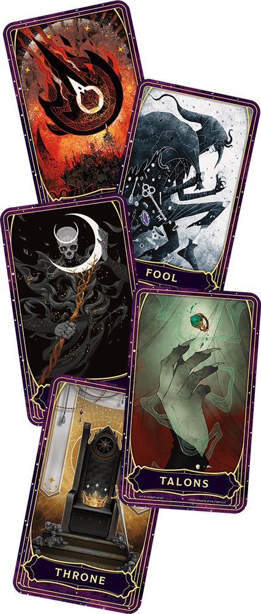

# Deck of Many Things

Usually found in a box or pouch, this deck contains a number of cards made of ivory or vellum. Most (75 percent) of these decks have thirteen cards, but some have twenty-two. Use the appropriate column of the Deck of Many Things table when randomly determining cards drawn from the deck.

Before you draw a card, you must declare how many cards you intend to draw and then draw them randomly. Any cards drawn in excess of this number have no effect. Otherwise, as soon as you draw a card from the deck, its magic takes effect. You must draw each card no more than 1 hour after the previous draw. If you fail to draw the chosen number, the remaining number of cards fly from the deck on their own and take effect all at once.

Once a card is drawn, it disappears. Unless the card is the Fool or Jester, the card reappears in the deck, making it possible to draw the same card twice. (Once the Fool or Jester has left the deck, reroll on the table if that card comes up again.)

| 1d100 (13-Card Deck) | 1d100 (22-Card Deck) | Card |
|---|---|---|
| — | 01–05 | Balance |
| — | 06–10 | Comet |
| — | 11–14 | Donjon |
| 01–08 | 15–18 | Euryale |
| — | 19–23 | Fates |
| 09–16 | 24–27 | Flames |
| — | 28–31 | Fool |
| — | 32–36 | Gem |
| 17–24 | 37–41 | Jester |
| 25–32 | 42–46 | Key |
| 33–40 | 47–51 | Knight |
| 41–48 | 52–56 | |
| — | 57–60 | Puzzle |
| 49–56 | 61–64 | Rogue |
| 57–64 | 65–68 | Ruin |
| — | 69–73 | Sage |
| 65–72 | 74–77 | Skull |
| 73–80 | 78–82 | Star |
| 81–88 | 83–87 | Sun |
| — | 88–91 | Talons |
| 89–96 | 92–96 | Throne |
| 97–00 | 97–00 | Void |

Each card’s effect is described below.

* **Balance.** You can increase one of your ability scores by 2, to a maximum of 22, provided you also decrease another one of your ability scores by 2. You can’t decrease an ability that has a score of 5 or lower. Alternatively, you can choose not to adjust your ability scores, in which case this card has no effect.

** Comet.** The next time you enter combat against one or more Hostile creatures, you can select one of them as your foe when you roll Initiative. If you reduce your foe to 0 Hit Points during that combat, you have Advantage on Death Saving Throws for 1 year. If someone else reduces your chosen foe to 0 Hit Points or you don’t choose a foe, this card has no effect.

* **Donjon.** You disappear and become entombed in a state of suspended animation in an extradimensional sphere. Everything you’re wearing and carrying disappears with you except for Artifacts, which stay behind in the space you occupied when you disappeared. You remain imprisoned until you are found and removed from the sphere. You can’t be located by any Divination magic, but a Wish spell can reveal the location of your prison. You draw no more cards.

* **Euryale.** The card’s medusa-like visage curses you. You take a −2 penalty to saving throws while cursed in this way. Only a god or the magic of the Fates card can end this curse.

* **Fates.** Reality’s fabric unravels and spins anew, allowing you to avoid or erase one event as if it never happened. You can use the card’s magic as soon as you draw the card or at any other time before you die.

* **Flames.** A powerful devil becomes your enemy. The devil seeks your ruin and torments you, savoring your suffering before attempting to slay you. This enmity lasts until either you or the devil dies.

* **Fool.** You have Disadvantage on D20 Tests for the next 72 hours. Draw another card; this draw doesn’t count as one of your declared draws.

* **Gem.** Twenty-five pieces of jewelry worth 2,000 GP each or fifty gems worth 1,000 GP each appear at your feet.

* Jester. *You have Advantage on D20 Tests for the next 72 hours, or you can draw two additional cards beyond your declared draws.

* **Key.** A Rare or rarer magic weapon with which you are proficient appears on your person. The DM chooses the weapon.

* **Knight.** You gain the service of a Knight, who magically appears in an unoccupied space you choose within 30 feet of yourself. The knight has the same alignment as you and serves you loyally until death, believing the two of you have been drawn together by fate. Work with your DM to create a name and backstory for this NPC. The DM can use a different stat block to represent the knight, as desired.

* **Moon.** You gain the ability to cast Wish 1d3 times.

* **Puzzle.** Permanently reduce your Intelligence or Wisdom by 1d4 + 1 (to a minimum score of 1). You can draw one additional card beyond your declared draws.

* **Rogue.** An NPC of the DM’s choice becomes Hostile toward you. You don’t know the identity of this NPC until they or someone else reveals it. Nothing less than a Wish spell or divine intervention can end the NPC’s hostility toward you.

* **Ruin.** All forms of wealth that you carry or own, other than magic items, are lost to you. Portable property vanishes. Businesses, buildings, and land you own are lost in a way that alters reality the least. If you have a Bastion (see the

*Dungeon Master’s Guide*), it is destroyed by some calamity beyond your control. Any documentation that proves you should own something lost to this card also disappears.

* **Sage.** At any time you choose within one year of drawing this card, you can ask a question in meditation and mentally receive a truthful answer to that question.

* **Skull.** An Avatar of Death appears in an unoccupied space as close to you as possible. The avatar targets only you with its attacks, appearing as a ghostly skeleton clad in a tattered black robe and carrying a spectral scythe. The avatar disappears when it drops to 0 Hit Points or you die. If an ally of yours deals damage to the avatar, that ally summons another Avatar of Death. The new avatar appears in an unoccupied space as close to that ally as possible and targets only that ally with its attacks. You and your allies can each summon only one avatar as a consequence of this draw. A creature slain by an avatar can’t be restored to life.

** Star. **Increase one of your ability scores by 2, to a maximum of 24.

** Sun.** A magic item (chosen by the DM) appears on your person. In addition, you gain 10 Temporary Hit Points daily at dawn until you die.

** Talons.** Every magic item you wear or carry disintegrates. Artifacts in your possession vanish instead.

** Throne.** You gain proficiency and Expertise in your choice of History, Insight, Intimidation, or Persuasion. In addition, you gain rightful ownership of a small keep somewhere in the world. However, the keep is currently home to one or more monsters, which must be cleared out before you can claim the keep as yours.

** Void.** Your soul is drawn from your body and contained in an object in a place of the DM’s choice. One or more powerful beings guard the place. While your soul is trapped in this way, your body is inert, ceases aging, and requires no food, air, or water. A Wish spell can’t return your soul to your body, but the spell reveals the location of the object that holds your soul. You draw no more cards.