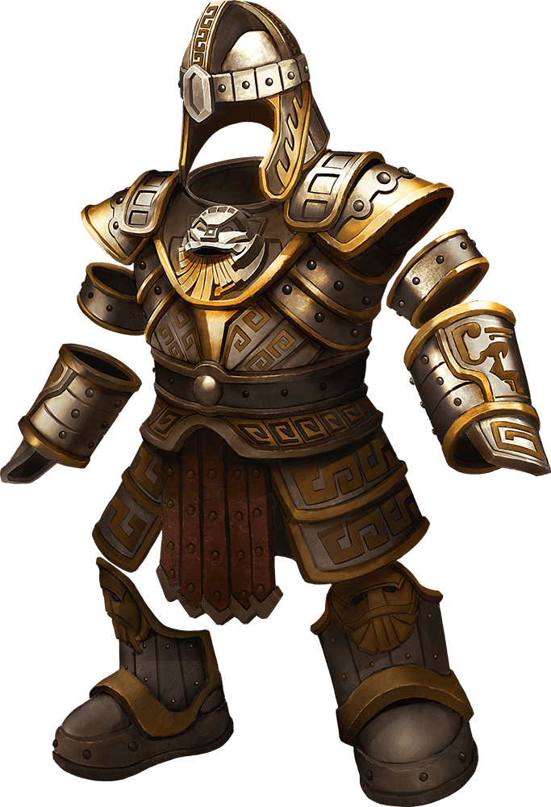

# Dwarven Plate

Armor (half plate or plate armor), very rare

While wearing this armor, you gain a +2 bonus to Armor Class. In addition, if an effect moves you against your will along the ground, you can take a Reaction to reduce the distance you are moved by up to 10 feet.

| Armor | Armor Class (AC) | Strength | Stealth |
|---|---|---|---|
| Dwarven Half Plate | 15 + Dex modifier (max 2) | - | Disadvantage |
| Dwarven Plate Armor | 18 | Str 15 | Disadvantage |

Notes: Bonus: Armor Class