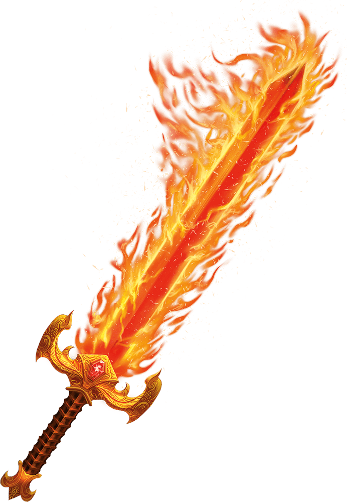

# Flame Tongue

While holding this magic weapon, you can take a Bonus Action and use a command word to cause flames to engulf the damage-dealing part of the weapon. These flames shed Bright Light in a 40-foot radius and Dim Light for an additional 40 feet. While the weapon is ablaze, it deals an extra 2d6 Fire damage on a hit. The flames last until you take a Bonus Action to issue the command again or until you drop, stow, or sheathe the weapon.

Weapons
| Name |
Damage |
Properties |
Mastery |
*Simple Melee Weapons* |
| Flame Tongue Club |
1d4 Bludgeoning |
Light |
Slow |
| Flame Tongue Dagger |
1d4 Piercing |
Finesse, Light, Thrown (Range 20/60) |
Nick |
| Flame Tongue Greatclub |
1d8 Bludgeoning |
Two-Handed |
Push |
| Flame Tongue Handaxe |
1d6 Slashing |
Light, Thrown (Range 20/60) |
Vex |
| Flame Tongue Javelin |
1d6 Piercing |
Thrown (Range 30/120) |
Slow |
| Flame Tongue Light Hammer |
1d4 Bludgeoning |
Light, Thrown (Range 20/60) |
Nick |
| Flame Tongue Mace |
1d6 Bludgeoning |
— |
Sap |
| Flame Tongue Quarterstaff |
1d6 Bludgeoning |
Versatile (1d8) |
Topple |
| Flame Tongue Sickle |
1d4 Slashing |
Light |
Nick |
| Flame Tongue Spear |
1d6 Piercing |
Thrown (Range 20/60), Versatile (1d8) |
Sap |
*Martial Melee Weapons* |
| Flame Tongue Battleaxe |
1d8 Slashing |
Versatile (1d10) |
Topple |
| Flame Tongue Flail |
1d8 Bludgeoning |
— |
Sap |
| Flame Tongue Glaive |
1d10 Slashing |
Heavy, Reach, Two-Handed
|
Graze |
| Flame Tongue Greataxe |
1d12 Slashing |
Heavy, Two-Handed
|
Cleave |
| Flame Tongue Greatsword |
2d6 Slashing |
Heavy, Two-Handed
|
Graze |
| Flame Tongue Halberd |
1d10 Slashing |
Heavy, Reach, Two-Handed
|
Cleave |
| Flame Tongue Lance |
1d10 Piercing |
Heavy, Reach, Two-Handed (unless mounted) |
Topple |
| Flame Tongue Longsword |
1d8 Slashing |
Versatile (1d10) |
Sap |
| Flame Tongue Maul |
2d6 Bludgeoning |
Heavy, Two-Handed
|
Topple |
| Flame Tongue Morningstar |
1d8 Piercing |
— |
Sap |
| Flame Tongue Pike |
1d10 Piercing |
Heavy, Reach, Two-Handed
|
Push |
| Flame Tongue Rapier |
1d8 Piercing |
Finesse |
Vex |
| Flame Tongue Scimitar |
1d6 Slashing |
Finesse, Light
|
Nick |
| Flame Tongue Shortsword |
1d6 Piercing |
Finesse, Light
|
Vex |
| Flame Tongue Trident |
1d8 Piercing |
Thrown (Range 20/60), Versatile (1d10) |
Topple |
| Flame Tongue Warhammer |
1d8 Bludgeoning |
Versatile (1d10) |
Push |
| Flame Tongue War Pick |
1d8 Piercing |
Versatile (1d10) |
Sap |
| Flame Tongue Whip |
1d4 Slashing |
Finesse, Reach
|
Slow |

Notes: Damage: Fire, Light, Slow