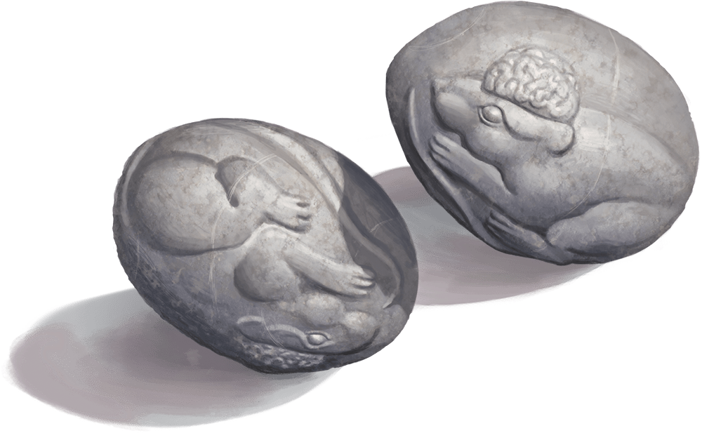

# Sending Stones

Wondrous Item, uncommon

*Sending Stones* come in pairs, with each stone carved to match the other so the pairing is easily recognized. While you touch one stone, you can cast Sending from it. The target is the bearer of the other stone. If no creature bears the other stone, you know that fact as soon as you use the stone, and you don’t cast the spell.

Once *Sending* is cast using either stone, the stones can’t be used again until the next dawn. If one of the stones in a pair is destroyed, the other one becomes nonmagical.

Notes: Communication