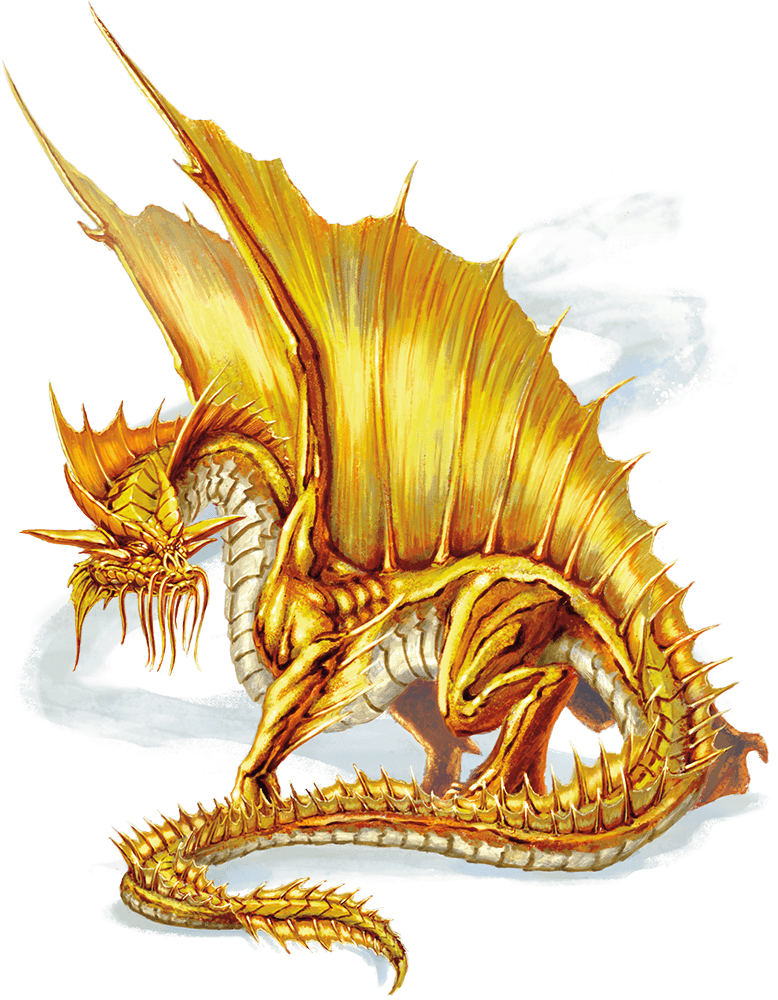

# Adult Gold Dragon

## Traits

* **Amphibious.** The dragon can breathe air and water.

* **Legendary Resistance (3/Day).** If the dragon fails a saving throw, it can choose to succeed instead.

## Actions

* **Multiattack.** The dragon can use its Frightful Presence. It then makes three attacks: one with its bite and two with its claws.

* **Bite.** *Melee Weapon Attack:* +14 to hit, reach 10 ft., one target.

*Hit:*19 (2d10 + 8) piercing damage.

* **Claw.** *Melee Weapon Attack:* +14 to hit, reach 5 ft., one target.

*Hit:*15 (2d6 + 8) slashing damage.

* **Tail.** *Melee Weapon Attack:* +14 to hit, reach 15 ft., one target.

*Hit:*17 (2d8 + 8) bludgeoning damage.

* **Frightful Presence.** Each creature of the dragon's choice that is within 120 feet of the dragon and aware of it must succeed on a DC 21 Wisdom saving throw or become frightened for 1 minute. A creature can repeat the saving throw at the end of each of its turns, ending the effect on itself on a success. If a creature's saving throw is successful or the effect ends for it, the creature is immune to the dragon's Frightful Presence for the next 24 hours.

* **Breath Weapons (Recharge 5–6).** The dragon uses one of the following breath weapons.

* **Fire Breath.** The dragon exhales fire in a 60-foot cone. Each creature in that area must make a DC 21 Dexterity saving throw, taking 66 (12d10) fire damage on a failed save, or half as much damage on a successful one.

* **Weakening Breath.** The dragon exhales gas in a 60-foot cone. Each creature in that area must succeed on a DC 21 Strength saving throw or have disadvantage on Strength-based attack rolls, Strength checks, and Strength saving throws for 1 minute. A creature can repeat the saving throw at the end of each of its turns, ending the effect on itself on a success.

* **Change Shape.** The dragon magically polymorphs into a humanoid or beast that has a challenge rating no higher than its own, or back into its true form. It reverts to its true form if it dies. Any equipment it is wearing or carrying is absorbed or borne by the new form (the dragon's choice).

In a new form, the dragon retains its alignment, hit points, Hit Dice, ability to speak, proficiencies, Legendary Resistance, lair actions, and Intelligence, Wisdom, and Charisma scores, as well as this action. Its statistics and capabilities are otherwise replaced by those of the new form, except any class features or legendary actions of that form.

## Legendary Actions

The dragon can take 3 legendary actions, choosing from the options below. Only one legendary action option can be used at a time and only at the end of another creature's turn. The dragon regains spent legendary actions at the start of its turn.

**Detect.** The dragon makes a Wisdom (Perception) check.

**Tail Attack.** The dragon makes a tail attack.

**Wing Attack (Costs 2 Actions).** The dragon beats its wings. Each creature within 10 feet of the dragon must succeed on a DC 22 Dexterity saving throw or take 15 (2d6 + 8) bludgeoning damage and be knocked prone. The dragon can then fly up to half its flying speed.

### A Gold Dragon’s Lair

Gold dragons make their homes in out-of-the-way places, where they can do as they please without arousing suspicion or fear. Most dwell near idyllic lakes and rivers, mist-shrouded islands, cave complexes hidden behind sparkling waterfalls, or ancient ruins.

#### Lair Actions

On initiative count 20 (losing initiative ties), the dragon takes a lair action to cause one of the following effects; the dragon can’t use the same effect two rounds in a row:

- The dragon glimpses the future, so it has advantage on attack rolls, ability checks, and saving throws until initiative count 20 on the next round.
- One creature the dragon can see within 120 feet of it must succeed on a DC 15 Charisma saving throw or be banished to a dream plane, a different plane of existence the dragon has imagined into being. To escape, the creature must use its action to make a Charisma check contested by the dragon’s. If the creature wins, it escapes the dream plane. Otherwise, the effect ends on initiative count 20 on the next round. When the effect ends, the creature reappears in the space it left or in the nearest unoccupied space if that one is occupied.

#### Regional Effects

The region containing a legendary gold dragon’s lair is warped by the dragon’s magic, which creates one or more of the following effects:

- Whenever a creature that can understand a language sleeps or enters a state of trance or reverie within 6 miles of the dragon’s lair, the dragon can establish telepathic contact with that creature and converse with it in its dreams. The creature remembers its conversation with the dragon upon waking.
- Banks of beautiful, opalescent mist manifest within 6 miles of the dragon’s lair. The mist doesn’t obscure anything. It assumes haunting forms when evil creatures are near the dragon or other non-evil creatures in the mist, warning such creatures of the danger.
- Gems and pearls within 1 mile of the dragon’s lair sparkle and gleam, shedding dim light in a 5-foot radius.

If the dragon dies, these effects end immediately.