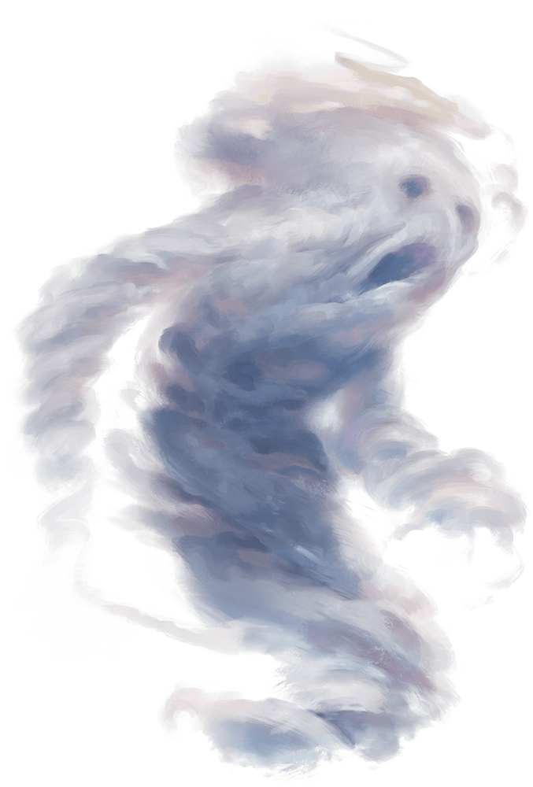

# Air Elemental

## Traits

* **Air Form.** The elemental can enter a hostile creature's space and stop there. It can move through a space as narrow as 1 inch wide without squeezing.

## Actions

* **Multiattack.** The elemental makes two slam attacks.

* **Slam.** *Melee Weapon Attack:* +8 to hit, reach 5 ft., one target.

*Hit:*14 (2d8 + 5) bludgeoning damage.

* **Whirlwind (Recharge 4–6).** Each creature in the elemental's space must make a DC 13 Strength saving throw. On a failure, a target takes 15 (3d8 + 2) bludgeoning damage and is flung up 20 feet away from the elemental in a random direction and knocked prone. If a thrown target strikes an object, such as a wall or floor, the target takes 3 (1d6) bludgeoning damage for every 10 feet it was thrown. If the target is thrown at another creature, that creature must succeed on a DC 13 Dexterity saving throw or take the same damage and be knocked prone.

If the saving throw is successful, the target takes half the bludgeoning damage and isn't flung away or knocked prone.

### Description

An air elemental is a funneling cloud of whirling air with a vague semblance of a face. It can turn itself into a screaming cyclone, creating a whirlwind that batters creatures even as it flings them away.