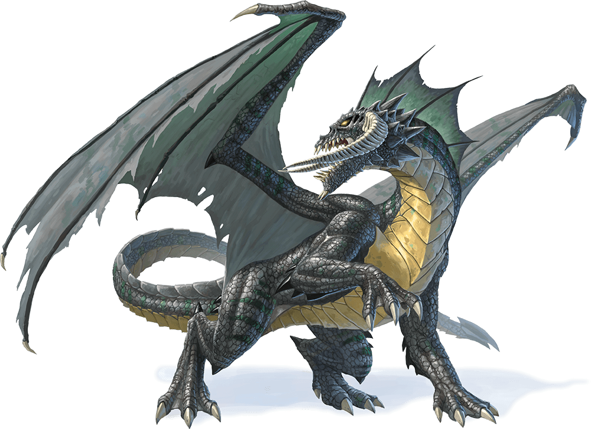

# Ancient Black Dragon

## Traits

* **Amphibious.** The dragon can breathe air and water.

* **Legendary Resistance (3/Day).** If the dragon fails a saving throw, it can choose to succeed instead.

## Actions

* **Multiattack.** The dragon can use its Frightful Presence. It then makes three attacks: one with its bite and two with its claws.

* **Bite.** *Melee Weapon Attack:* +15 to hit, reach 15 ft., one target.

*Hit:*19 (2d10 + 8) piercing damage plus 9 (2d8) acid damage.

* **Claw.** *Melee Weapon Attack:* +15 to hit, reach 10 ft., one target.

*Hit:*15 (2d6 + 8) slashing damage.

* **Tail.** *Melee Weapon Attack:* +15 to hit, reach 20 ft., one target.

*Hit:*17 (2d8 + 8) bludgeoning damage.

* **Frightful Presence.** Each creature of the dragon's choice that is within 120 feet of the dragon and aware of it must succeed on a DC 19 Wisdom saving throw or become frightened for 1 minute. A creature can repeat the saving throw at the end of each of its turns, ending the effect on itself on a success. If a creature's saving throw is successful or the effect ends for it, the creature is immune to the dragon's Frightful Presence for the next 24 hours.

* **Acid Breath (Recharge 5–6).** The dragon exhales acid in a 90-foot line that is 10 feet wide. Each creature in that line must make a DC 22 Dexterity saving throw, taking 67 (15d8) acid damage on a failed save, or half as much damage on a successful one.

## Legendary Actions

The dragon can take 3 legendary actions, choosing from the options below. Only one legendary action option can be used at a time and only at the end of another creature's turn. The dragon regains spent legendary actions at the start of its turn.

**Detect.** The dragon makes a Wisdom (Perception) check.

**Tail Attack.** The dragon makes a tail attack.

**Wing Attack (Costs 2 Actions).** The dragon beats its wings. Each creature within 15 feet of the dragon must succeed on a DC 23 Dexterity saving throw or take 15 (2d6 + 8) bludgeoning damage and be knocked prone. The dragon can then fly up to half its flying speed.

Black dragons dwell in swamps on the frayed edges of civilization. A black dragon’s lair is a dismal cave, grotto, or ruin that is at least partially flooded, providing pools where the dragon rests, and where its victims can ferment. The lair is littered with the acid-pitted bones of previous victims and the fly-ridden carcasses of fresh kills, watched over by crumbling statues. Centipedes, scorpions, and snakes infest the lair, which is filled with the stench of death and decay.

#### Lair Actions

On initiative count 20 (losing initiative ties), the dragon takes a lair action to cause one of the following effects; the dragon can’t use the same effect two rounds in a row:

- Pools of water that the dragon can see within 120 feet of it surge outward in a grasping tide. Any creature on the ground within 20 feet of such a pool must succeed on a DC 15 Strength saving throw or be pulled up to 20 feet into the water and knocked prone.
- A cloud of swarming insects fills a 20-foot-radius sphere centered on a point the dragon chooses within 120 feet of it. The cloud spreads around corners and remains until the dragon dismisses it as an action, uses this lair action again, or dies. The cloud is lightly obscured. Any creature in the cloud when it appears must make on a DC 15 Constitution saving throw, taking 10 (3d10) piercing damage on a failed save, or half as much damage on a successful one. A creature that ends its turn in the cloud takes 10 (3d10) piercing damage.
- Magical darkness spreads from a point the dragon chooses within 60 feet of it, filling a 15-foot-radius sphere until the dragon dismisses it as an action, uses this lair action again, or dies. The darkness spreads around corners. A creature with darkvision can’t see through this darkness, and nonmagical light can’t illuminate it. If any of the effect’s area overlaps with an area of light created by a spell of 2nd level or lower, the spell that created the light is dispelled.

#### Regional Effects

The region containing a legendary black dragon’s lair is warped by the dragon’s magic, which creates one or more of the following effects:

- The land within 6 miles of the lair takes twice as long as normal to traverse, since the plants grow thick and twisted, and the swamps are thick with reeking mud.
- Water sources within 1 mile of the lair are supernaturally fouled. Enemies of the dragon that drink such water regurgitate it within minutes.

Fog lightly obscures the land within 6 miles of the lair.

If the dragon dies, vegetation remains as it has grown, but other effects fade over 1d10 days.