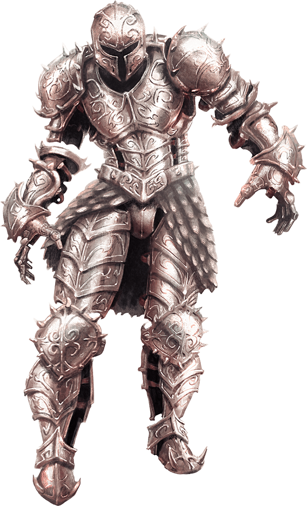

# Animated Armor

Armor Class
18
(natural armor)

Hit Points
33
(6d8 + 6)

Speed
25 ft.

STR

14
(+2)

DEX

11
(+0)

CON

13
(+1)

INT

1
(-5)

WIS

3
(-4)

CHA

1
(-5)

Damage Immunities
Poison, Psychic

Condition Immunities
Blinded, Charmed, Deafened, Exhaustion, Frightened, Paralyzed, Petrified, Poisoned

Senses
Blindsight 60 ft. (blind beyond this radius), Passive Perception 6

Languages
--

Challenge
1 (200 XP)

Proficiency Bonus
+2

## Traits

* **Antimagic Susceptibility.** The armor is incapacitated while in the area of an antimagic field. If targeted by dispel magic, the armor must succeed on a Constitution saving throw against the caster's spell save DC or fall unconscious for 1 minute.

* **False Appearance.** While the armor remains motionless, it is indistinguishable from a normal suit of armor.

## Actions

* **Multiattack.** The armor makes two melee attacks.

* **Slam.** *Melee Weapon Attack:* +4 to hit, reach 5 ft., one target.

*Hit:*5 (1d6 + 2) bludgeoning damage.

### Description

This suit of magically animated plate armor clamors as it moves, banging and grinding like the vengeful spirit of a fallen knight.