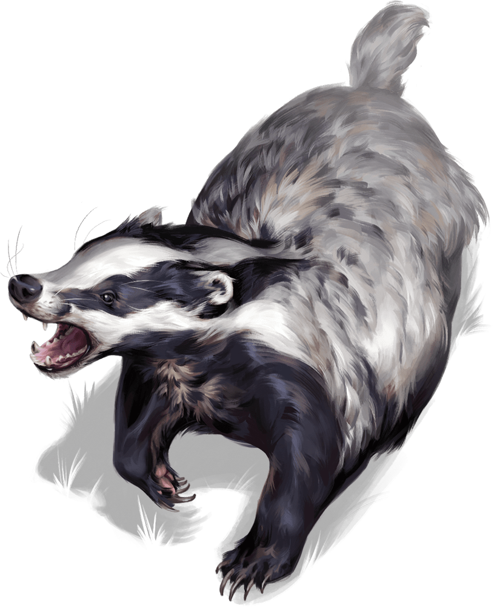

# Badger

Armor Class
11

Hit Points
5
(1d4 + 3)

Speed
20 ft., burrow 5 ft.

STR

10
(+0)

DEX

11
(+0)

CON

16
(+3)

INT

2
(-4)

WIS

12
(+1)

CHA

5
(-3)

Skills
Perception +3

Damage Resistances
Poison

Senses
Darkvision 30 ft., Passive Perception 13

Languages
None

Challenge
0 (10 XP)

Proficiency Bonus
+2

## Actions

* **Bite.** *Melee Attack Roll:* +2, reach 5 ft.

*Hit:*1 Piercing damage.