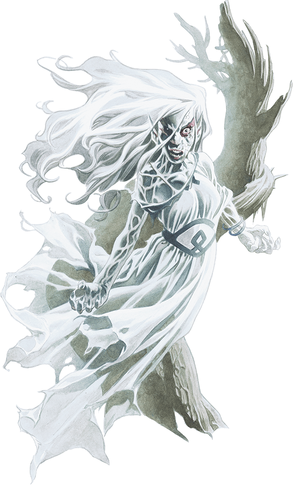

# Banshee

## Traits

* **Detect Life.** The banshee can magically sense the presence of creatures up to 5 miles away that aren’t undead or constructs. She knows the general direction they’re in but not their exact locations.

* **Incorporeal Movement.** The banshee can move through other creatures and objects as if they were difficult terrain. She takes 5 (1d10) force damage if she ends her turn inside an object.

## Actions

* **Corrupting Touch.** *Melee Spell Attack:* +4 to hit, reach 5 ft., one target.

*Hit:*12 (3d6 + 2) necrotic damage.

* **Horrifying Visage.** Each non-undead creature within 60 feet of the banshee that can see her must succeed on a DC 13 Wisdom saving throw or be frightened for 1 minute. A frightened target can repeat the saving throw at the end of each of its turns, with disadvantage if the banshee is within line of sight, ending the effect on itself on a success. If a target’s saving throw is successful or the effect ends for it, the target is immune to the banshee’s Horrifying Visage for the next 24 hours.

* **Wail (1/Day).** The banshee releases a mournful wail, provided that she isn’t in sunlight. This wail has no effect on constructs and undead. All other creatures within 30 feet of her that can hear her must make a DC 13 Constitution saving throw. On a failure, a creature drops to 0 hit points. On a success, a creature takes 10 (3d6) psychic damage.

### Description

The woeful banshee is a spiteful creature formed from the spirit of a female elf. Its face is wreathed in a wild tangle of hair, its body clad in wispy rags that flutter and stream around it.