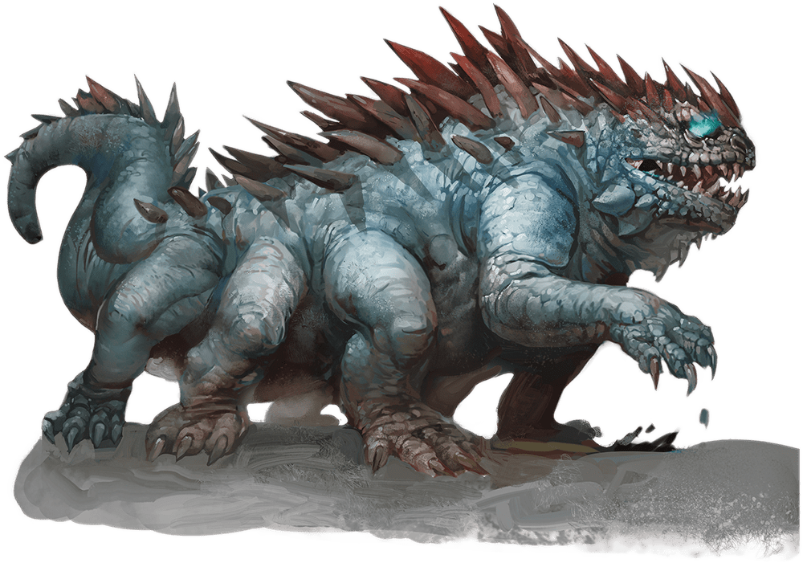

# Basilisk

## Traits

* **Petrifying Gaze.** If a creature starts its turn within 30 feet of the basilisk and the two of them can see each other, the basilisk can force the creature to make a DC 12 Constitution saving throw if the basilisk isn't incapacitated. On a failed save, the creature magically begins to turn to stone and is restrained. It must repeat the saving throw at the end of its next turn. On a success, the effect ends. On a failure, the creature is petrified until freed by the greater restoration spell or other magic.

A creature that isn't surprised can avert its eyes to avoid the saving throw at the start of its turn. If it does so, it can't see the basilisk until the start of its next turn, when it can avert its eyes again.

If it looks at the basilisk in the meantime, it must immediately make the save. If the basilisk sees its reflection within 30 feet of it in bright light, it mistakes itself for a rival and targets itself with its gaze.

## Actions

* **Bite.** *Melee Weapon Attack:* +5 to hit, reach 5 ft., one target.

*Hit:*10 (2d6 + 3) piercing damage plus 7 (2d6) poison damage.

### Description

A basilisk is a multilegged, reptilian horror whose deadly gaze transforms victims into porous stone. With its strong jaws, the creature consumes this stone, which returns to organic form in its gullet.