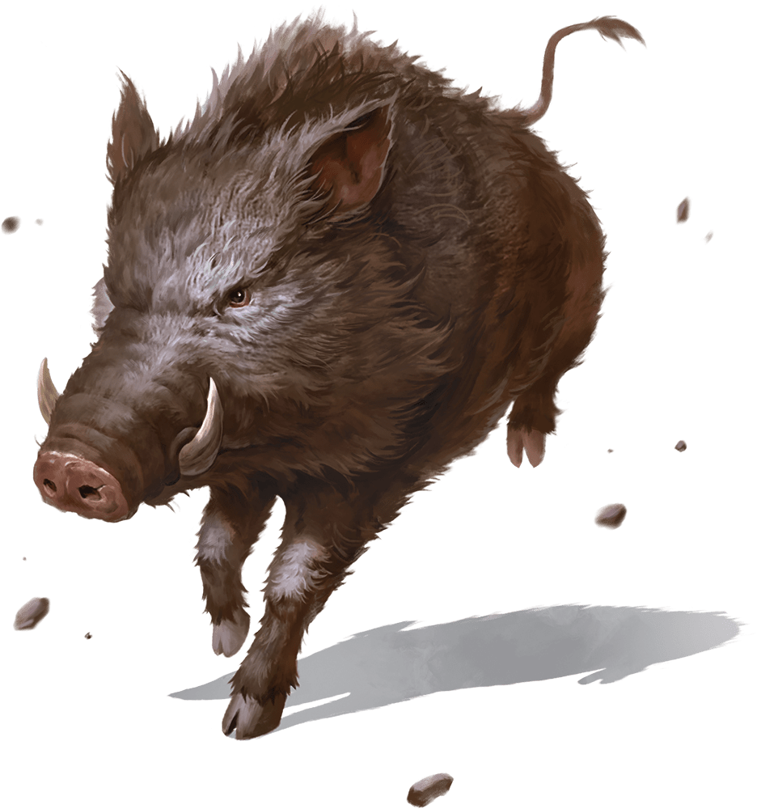

# Boar

Armor Class
11

Hit Points
13
(2d8 + 4)

Speed
40 ft.

STR

13
(+1)

DEX

11
(+0)

CON

14
(+2)

INT

2
(-4)

WIS

9
(-1)

CHA

5
(-3)

Senses
Passive Perception 9

Languages
None

Challenge
1/4 (50 XP)

Proficiency Bonus
+2

## Actions

* **Gore.** *Melee Attack Roll:* +3, reach 5 ft. Hit: 4 (1d6 + 1) Piercing damage. If the boar moved at least 20 feet straight toward the target immediately before the hit, the target takes an extra 3 (1d6) Piercing damage and, if it is Large or smaller, has the Prone condition.