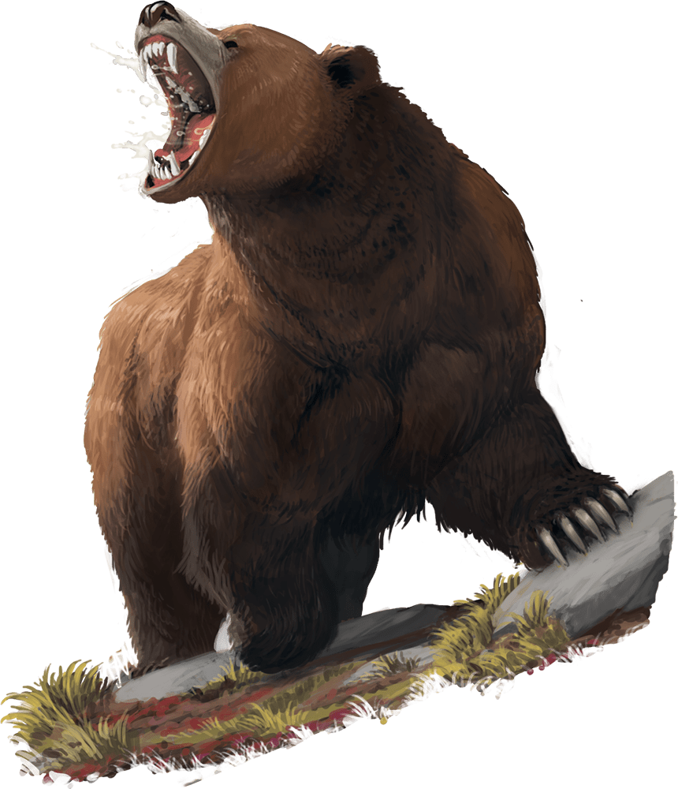

# Brown Bear

Armor Class
11

Hit Points
22
(3d10 + 6)

Speed
40 ft., climb 30 ft.

STR

17
(+3)

DEX

12
(+1)

CON

15
(+2)

INT

2
(-4)

WIS

13
(+1)

CHA

7
(-2)

Skills
Perception +3

Senses
Darkvision 60 ft., Passive Perception 13

Languages
None

Challenge
1 (200 XP)

Proficiency Bonus
+2

## Actions

* **Multiattack.** The bear makes one Bite attack and one Claw attack.

* **Bite.** *Melee Attack Roll:* +5, reach 5 ft.

*Hit:*7 (1d8 + 3) Piercing damage.

* **Claw.** *Melee Attack Roll:* +5, reach 5 ft.

*Hit:*5 (1d4 + 3) Slashing damage, and the target has the Prone condition if it is Huge or smaller.