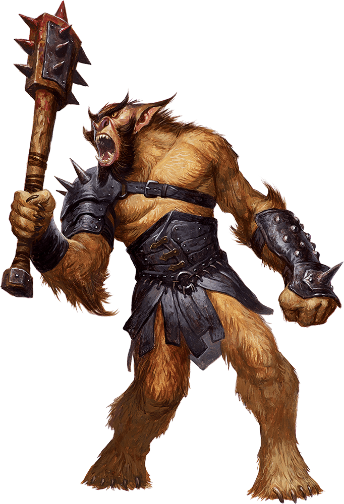

# Bugbear

Armor Class
16
(hide armor, shield)

Hit Points
27
(5d8 + 5)

Speed
30 ft.

STR

15
(+2)

DEX

14
(+2)

CON

13
(+1)

INT

8
(-1)

WIS

11
(+0)

CHA

9
(-1)

Senses
Darkvision 60 ft., Passive Perception 10

Languages
Common, Goblin

Challenge
1 (200 XP)

Proficiency Bonus
+2

## Traits

* **Brute.** A melee weapon deals one extra die of its damage when the bugbear hits with it (included in the attack).

* **Surprise Attack.** If the bugbear surprises a creature and hits it with an attack during the first round of combat, the target takes an extra 7 (2d6) damage from the attack.

## Actions

* **Morningstar.** *Melee Weapon Attack:* +4 to hit, reach 5 ft., one target.

*Hit:*11 (2d8 + 2) piercing damage.

* **Javelin.** *Melee or Ranged Weapon Attack:* +4 to hit, reach 5 ft. or range 30/120 ft., one target.

*Hit:*9 (2d6 + 2) piercing damage in melee or 5 (1d6 + 2) piercing damage at range.

### Description

Bugbears are hairy goblinoids born for battle and mayhem. They survive by raiding and hunting, but are fond of setting ambushes and fleeing when outmatched.