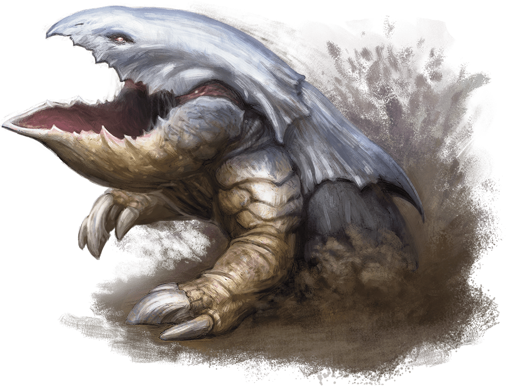

# Bulette

## Traits

* **Standing Leap.** The bulette's long jump is up to 30 feet and its high jump is up to 15 feet, with or without a running start.

## Actions

* **Bite.** *Melee Weapon Attack:* +7 to hit, reach 5 ft., one target.

*Hit:*30 (4d12 + 4) piercing damage.

* **Deadly Leap.** If the bulette jumps at least 15 feet as part of its movement, it can then use this action to land on its feet in a space that contains one or more other creatures. Each of those creatures must succeed on a DC 16 Strength or Dexterity saving throw (target's choice) or be knocked prone and take 14 (3d6 + 4) bludgeoning damage plus 14 (3d6 + 4) slashing damage. On a successful save, the creature takes only half the damage, isn't knocked prone, and is pushed 5 feet out of the bulette's space into an unoccupied space of the creature's choice. If no unoccupied space is within range, the creature instead falls prone in the bulette's space.