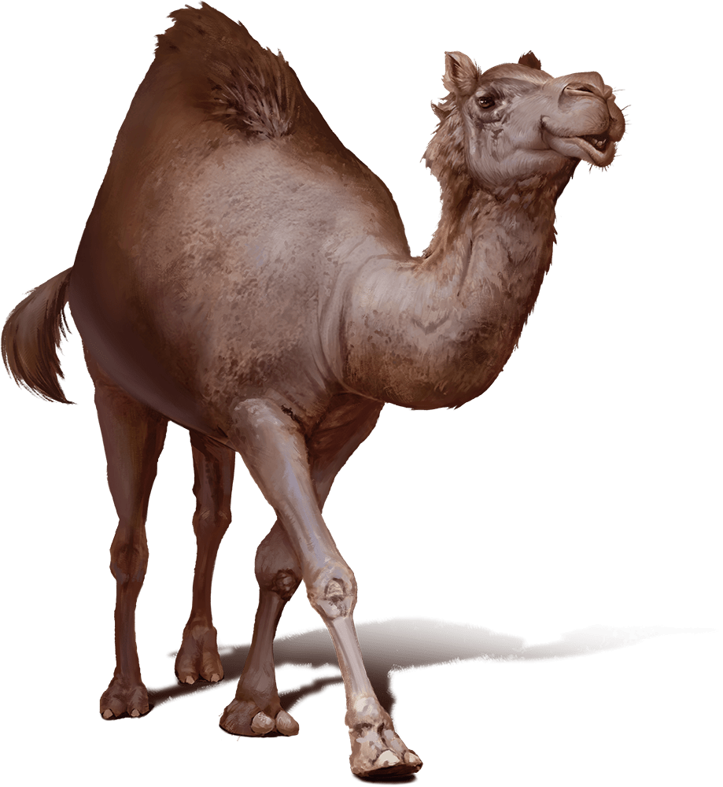

# Camel

Armor Class
10

Hit Points
17
(2d10 + 6)

Speed
50 ft.

STR

15
(+2)

DEX

8
(-1)

CON

17
(+3)

INT

2
(-4)

WIS

11
(+0)

CHA

5
(-3)

Senses
Darkvision 60 ft., Passive Perception 10

Languages
None

Challenge
1/8 (25 XP)

Proficiency Bonus
+2

## Actions

* **Bite.** *Melee Attack Roll:* +4, reach 5 ft.

*Hit*: 4 (1d4 + 2) Bludgeoning damage.