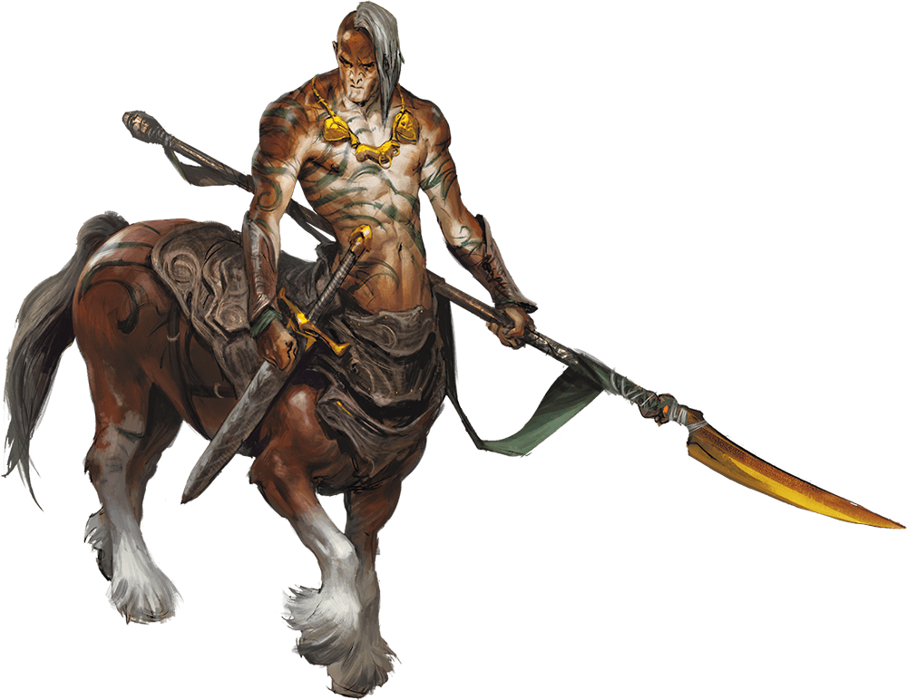

# Centaur

Armor Class
12

Hit Points
45
(6d10 + 12)

Speed
50 ft.

STR

18
(+4)

DEX

14
(+2)

CON

14
(+2)

INT

9
(-1)

WIS

13
(+1)

CHA

11
(+0)

Skills
Athletics +6, Perception +3, Survival +3

Senses
Passive Perception 13

Languages
Elvish, Sylvan

Challenge
2 (450 XP)

Proficiency Bonus
+2

## Traits

* **Charge.** If the centaur moves at least 30 feet straight toward a target and then hits it with a pike attack on the same turn, the target takes an extra 10 (3d6) piercing damage.

## Actions

* **Multiattack.** The centaur makes two attacks: one with its pike and one with its hooves or two with its longbow.

* **Pike.** *Melee Weapon Attack:* +6 to hit, reach 10 ft., one target.

*Hit:*9 (1d10 + 4) piercing damage.

* **Hooves.** *Melee Weapon Attack:* +6 to hit, reach 5 ft., one target.

*Hit:*11 (2d6 + 4) bludgeoning damage.

* **Longbow.** *Ranged Weapon Attack:* +4 to hit, range 150/600 ft., one target.

*Hit:*6 (1d8 + 2) piercing damage.

### Description

A centaur has the body of a great horse topped by a humanoid torso, head, and arms. Reclusive wanderers, they avoid conflict but fight fiercely when pressed.