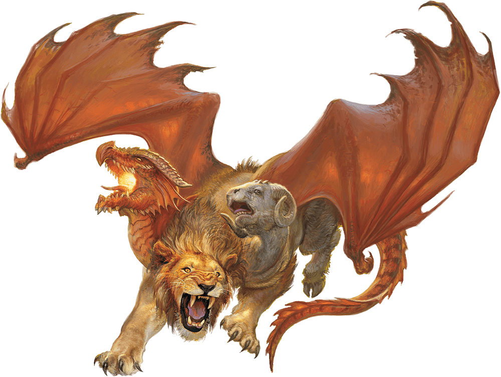

# Chimera

## Actions

* **Multiattack.** The chimera makes three attacks: one with its bite, one with its horns, and one with its claws. When its fire breath is available, it can use the breath in place of its bite or horns.

* **Bite.** *Melee Weapon Attack:* +7 to hit, reach 5 ft., one target.

*Hit:*11 (2d6 + 4) piercing damage.

* **Horns.** *Melee Weapon Attack:* +7 to hit, reach 5 ft., one target.

*Hit:*10 (1d12 + 4) bludgeoning damage.

* **Claws.** *Melee Weapon Attack:* +7 to hit, reach 5 ft., one target.

*Hit:*11 (2d6 + 4) slashing damage.

* **Fire Breath (Recharge 5–6).** The dragon head exhales fire in a 15-foot cone. Each creature in that area must make a DC 15 Dexterity saving throw, taking 31 (7d8) fire damage on a failed save, or half as much damage on a successful one.

### Description

A chimera is a vile combination of goat, lion, and dragon, and features the heads of all three of those creatures. It likes to swoop down from the sky and engulf prey with its fiery breath before landing to attack.