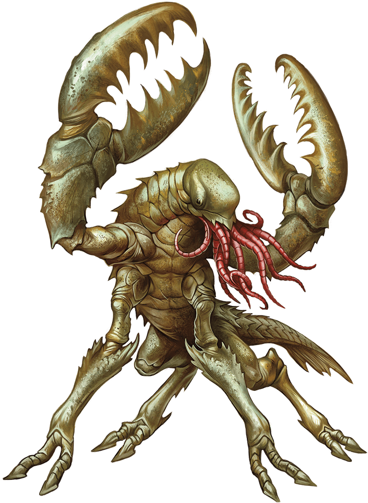

# Chuul

## Traits

* **Amphibious.** The chuul can breathe air and water.

* **Sense Magic.** The chuul senses magic within 120 feet of it at will. This trait otherwise works like the detect magic spell but isn't itself magical.

## Actions

* **Multiattack.** The chuul makes two pincer attacks. If the chuul is grappling a creature, the chuul can also use its tentacles once.

* **Pincer.** *Melee Weapon Attack:* +6 to hit, reach 10 ft., one target.

*Hit:*11 (2d6 + 4) bludgeoning damage. The target is grappled (escape DC 14) if it is a Large or smaller creature and the chuul doesn't have two other creatures grappled.

* **Tentacles.** One creature grappled by the chuul must succeed on a DC 13 Constitution saving throw or be poisoned for 1 minute. Until this poison ends, the target is paralyzed. The target can repeat the saving throw at the end of each of its turns, ending the effect on itself on a success.