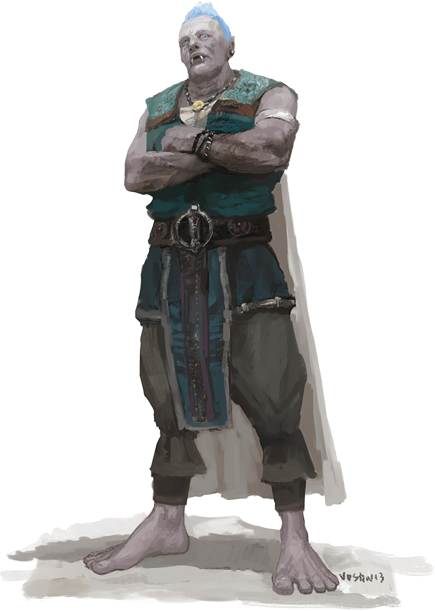

# Cloud Giant

Armor Class
14
(natural armor)

Hit Points
200
(16d12 + 96)

Speed
40 ft.

STR

27
(+8)

DEX

10
(+0)

CON

22
(+6)

INT

12
(+1)

WIS

16
(+3)

CHA

16
(+3)

Saving Throws
CON +10, WIS +7, CHA +7

Skills
Insight +7, Perception +7

Senses
Passive Perception 17

Languages
Common, Giant

Challenge
9 (5,000 XP)

Proficiency Bonus
+4

## Traits

* **Keen Smell.** The giant has advantage on Wisdom (Perception) checks that rely on smell.

* **Innate Spellcasting.** The giant's innate spellcasting ability is Charisma. It can innately cast the following spells, requiring no material components:

At will: detect magic, fog cloud, light

3/day each: feather fall, fly, misty step, telekinesis

1/day each: control weather, gaseous form

## Actions

* **Multiattack.** The giant makes two morningstar attacks.

* **Morningstar.** *Melee Weapon Attack:* +12 to hit, reach 10 ft., one target.

*Hit:*21 (3d8 + 8) piercing damage.

* **Rock.** *Ranged Weapon Attack:* +12 to hit, range 60/240 ft., one target.

*Hit:*30 (4d10 + 8) bludgeoning damage.