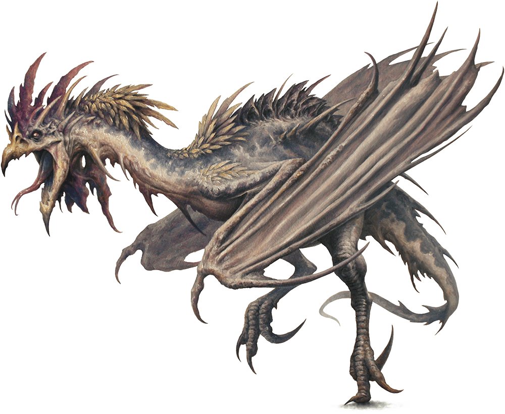

# Cockatrice

Armor Class
11

Hit Points
27
(6d6 + 6)

Speed
20 ft., fly 40 ft.

STR

6
(-2)

DEX

12
(+1)

CON

12
(+1)

INT

2
(-4)

WIS

13
(+1)

CHA

5
(-3)

Senses
Darkvision 60 ft., Passive Perception 11

Languages
--

Challenge
1/2 (100 XP)

Proficiency Bonus
+2

## Actions

* **Bite.** *Melee Weapon Attack:* +3 to hit, reach 5 ft., one creature.

*Hit:*3 (1d4 + 1) piercing damage, and the target must succeed on a DC 11 Constitution saving throw against being magically petrified. On a failed save, the creature begins to turn to stone and is restrained. It must repeat the saving throw at the end of its next turn. On a success, the effect ends. On a failure, the creature is petrified for 24 hours.

### Description

The cockatrice looks like a hideous hybrid of lizard, bird, and bat. It is infamous for its ability to turn flesh to stone.