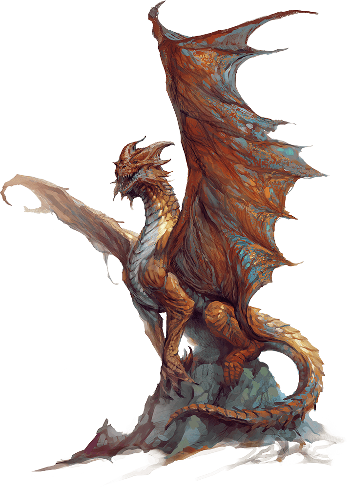

# Copper Dragon Wyrmling

## Actions

* **Bite.** *Melee Weapon Attack:* +4 to hit, reach 5 ft., one target.

*Hit:*7 (1d10 + 2) piercing damage.

* **Breath Weapons (Recharge 5–6).** The dragon uses one of the following breath weapons.

* **Acid Breath.** The dragon exhales acid in an 20-foot line that is 5 feet wide. Each creature in that line must make a DC 11 Dexterity saving throw, taking 18 (4d8) acid damage on a failed save, or half as much damage on a successful one.

* **Slowing Breath.** The dragon exhales gas in a 15-foot cone. Each creature in that area must succeed on a DC 11 Constitution saving throw. On a failed save, the creature can't use reactions, its speed is halved, and it can't make more than one attack on its turn. In addition, the creature can use either an action or a bonus action on its turn, but not both. These effects last for 1 minute. The creature can repeat the saving throw at the end of each of its turns, ending the effect on itself with a successful save.