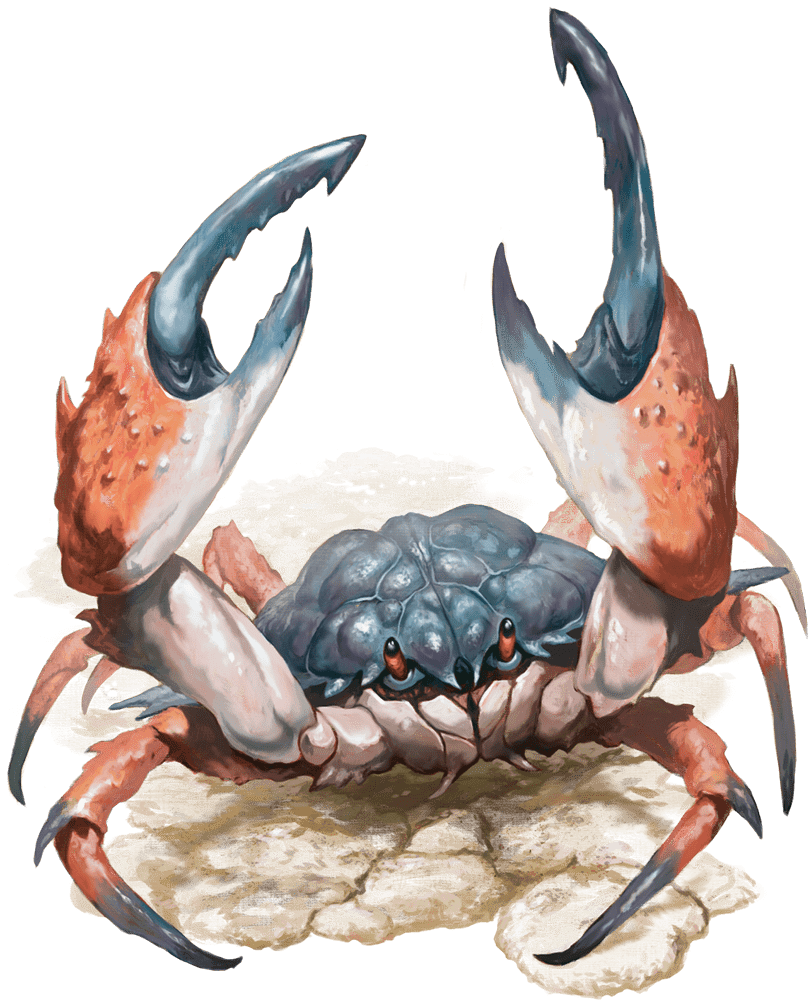

# Crab

Armor Class
11

Hit Points
3
(1d4 + 1)

Speed
20 ft., swim 20 ft.

STR

6
(-2)

DEX

11
(+0)

CON

12
(+1)

INT

1
(-5)

WIS

8
(-1)

CHA

2
(-4)

Skills
Stealth +2

Senses
Blindsight 30 ft., Passive Perception 9

Languages
None

Challenge
0 (10 XP)

Proficiency Bonus
+2

## Traits

* **Amphibious.** The crab can breathe air and water.

## Actions

* **Claw.** *Melee Attack Roll:* +2, reach 5 ft.

*Hit:*1 Bludgeoning damage.