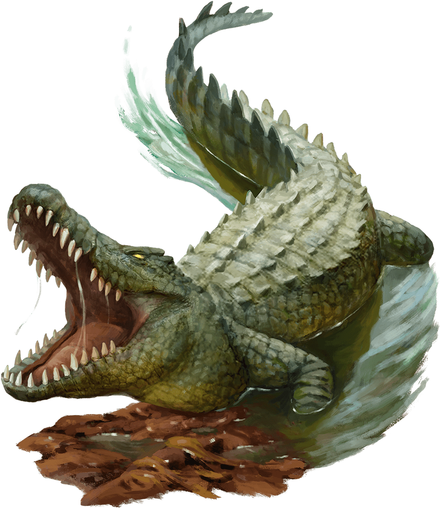

# Crocodile

Armor Class
12

Hit Points
13
(2d10 + 2)

Speed
20 ft., swim 30 ft.

STR

15
(+2)

DEX

10
(+0)

CON

13
(+1)

INT

2
(-4)

WIS

10
(+0)

CHA

5
(-3)

Skills
Stealth +2

Senses
Passive Perception 10

Languages
None

Challenge
1/2 (100 XP)

Proficiency Bonus
+2

## Traits

* **Hold Breath.** The crocodile can hold its breath for 1 hour.

## Actions

* **Bite.** *Melee Attack Roll:* +4, reach 5 ft.

*6 (1d8 + 2) Piercing damage. If the target is Medium or smaller, it has the Grappled condition (escape DC 12). While Grappled, the target has the Restrained condition.*

*Hit:*