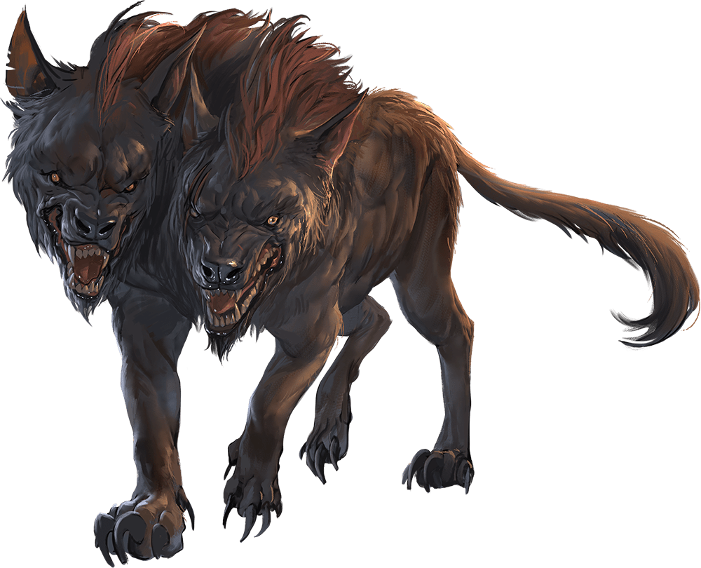

# Death Dog

## Traits

* **Two-Headed.** The dog has advantage on Wisdom (Perception) checks and on saving throws against being blinded, charmed, deafened, frightened, stunned, or knocked unconscious.

## Actions

* **Multiattack.** The dog makes two bite attacks.

* **Bite.** *Melee Weapon Attack:* +4 to hit, reach 5 ft., one target.

*Hit:*5 (1d6 + 2) piercing damage. If the target is a creature, it must succeed on a DC 12 Constitution saving throw against disease or become poisoned until the disease is cured. Every 24 hours that elapse, the creature must repeat the saving throw, reducing its hit point maximum by 5 (1d10) on a failure. This reduction lasts until the disease is cured. The creature dies if the disease reduces its hit point maximum to 0.

### Description

A death dog is an ugly two-headed hound that roams plains, and deserts. Hate burns in a death dog's heart, and a taste for humanoid flesh drives it to attack travelers and explorers. Death dog saliva carries a foul disease that causes a victim's flesh to slowly rot off the bone.