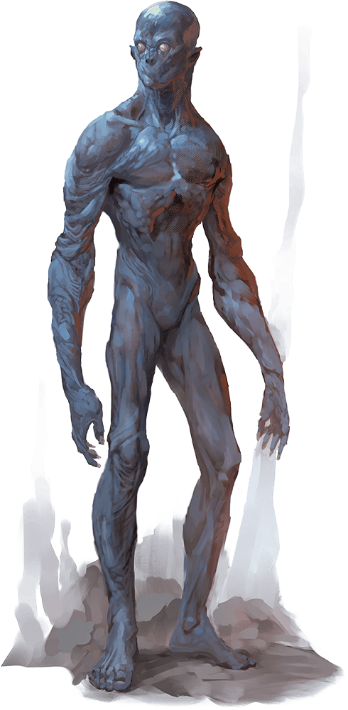

# Doppelganger

## Traits

* **Shapechanger.** The doppelganger can use its action to polymorph into a Small or Medium humanoid it has seen, or back into its true form. Its statistics, other than its size, are the same in each form. Any equipment it is wearing or carrying isn't transformed. It reverts to its true form if it dies.

* **Ambusher.** The doppelganger has advantage on attack rolls against any creature it has surprised.

* **Surprise Attack.** If the doppelganger surprises a creature and hits it with an attack during the first round of combat, the target takes an extra 10 (3d6) damage from the attack.

## Actions

* **Multiattack.** The doppelganger makes two melee attacks.

* **Slam.** *Melee Weapon Attack:* +6 to hit, reach 5 ft., one target.

*Hit:*7 (1d6 + 4) bludgeoning damage.

* **Read Thoughts.** The doppelganger magically reads the surface thoughts of one creature within 60 feet of it. The effect can penetrate barriers, but 3 feet of wood or dirt, 2 feet of stone, 2 inches of metal, or a thin sheet of lead blocks it. While the target is in range, the doppelganger can continue reading its thoughts, as long as the doppelganger's concentration isn't broken (as if concentrating on a spell). While reading the target's mind, the doppelganger has advantage on Wisdom (Insight) and Charisma (Deception, Intimidation, and Persuasion) checks against the target.

### Description

Doppelgangers are devious shapeshifters that take on the appearance of other humanoids, throwing off pursuit or luring victims to their doom with misdirection and disguise.