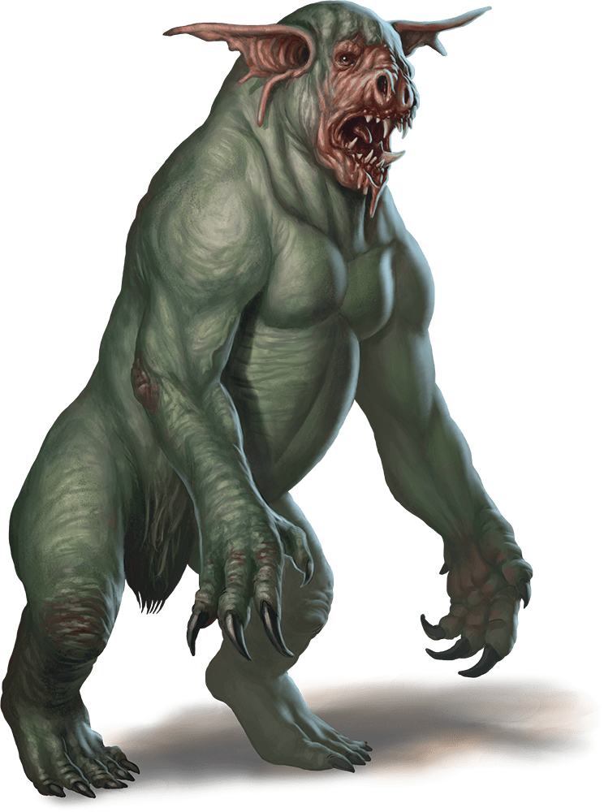

# Dretch

## Actions

* **Multiattack.** The dretch makes two attacks: one with its bite and one with its claws.

* **Bite.** *Melee Weapon Attack:* +2 to hit, reach 5 ft., one target.

*Hit:*3 (1d6) piercing damage.

* **Claws.** *Melee Weapon Attack:* +2 to hit, reach 5 ft., one target.

*Hit:*5 (2d4) slashing damage.

* **Fetid Cloud (1/Day).** A 10-foot radius of disgusting green gas extends out from the dretch. The gas spreads around corners, and its area is lightly obscured. It lasts for 1 minute or until a strong wind disperses it. Any creature that starts its turn in that area must succeed on a DC 11 Constitution saving throw or be poisoned until the start of its next turn. While poisoned in this way, the target can take either an action or a bonus action on its turn, not both, and can't take reactions.