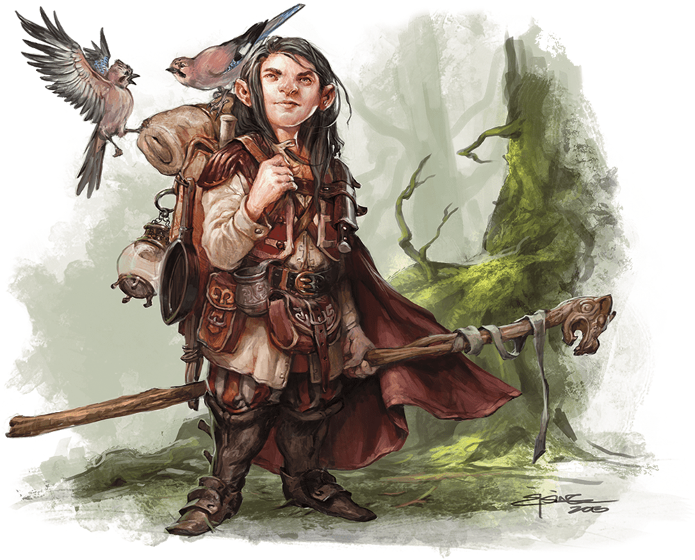

# Druid

## Traits

* **Spellcasting.** The druid is a 4th-level spellcaster. Its spellcasting ability is Wisdom (spell save DC 12, +4 to hit with spell attacks). It has the following druid spells prepared:

Cantrips (at will): druidcraft, produce flame, shillelagh

1st level (4 slots): entangle, longstrider, speak with animals, thunderwave

2nd level (3 slots): animal messenger, barkskin

## Actions

* **Quarterstaff.** *Melee Weapon Attack:* +2 to hit (+4 to hit with shillelagh), reach 5 ft., one target.

*Hit:*3 (1d6) bludgeoning damage, 4 (1d8) bludgeoning damage if wielded with two hands, or 6 (1d8 + 2) bludgeoning damage with shillelagh.

### Description

Druids dwell in forests and other secluded wilderness locations, where they protect the natural world from monsters and the encroachment of civilization. Some are tribal shamans who heal the sick, pray to animal spirits, and provide spiritual guidance.