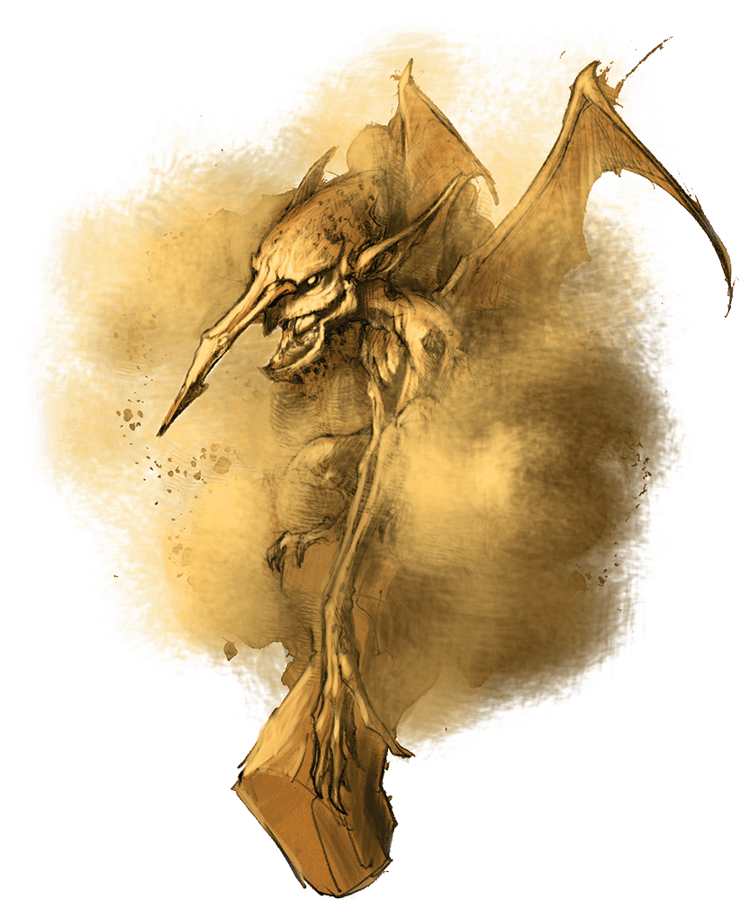

# Dust Mephit

## Traits

* **Death Burst.** When the mephit dies, it explodes in a burst of dust. Each creature within 5 feet of it must then succeed on a DC 10 Constitution saving throw or be blinded for 1 minute. A blinded creature can repeat the saving throw on each of its turns, ending the effect on itself on a success.

* **Innate Spellcasting (1/Day).** The mephit can innately cast sleep, requiring no material components. Its innate spellcasting ability is Charisma.

## Actions

* **Claws.** *Melee Weapon Attack:* +4 to hit, reach 5 ft., one creature.

*Hit:*4 (1d4 + 2) slashing damage.

* **Blinding Breath (Recharge 6).** The mephit exhales a 15- foot cone of blinding dust. Each creature in that area must succeed on a DC 10 Dexterity saving throw or be blinded for 1 minute. A creature can repeat the saving throw at the end of each of its turns, ending the effect on itself on a success.