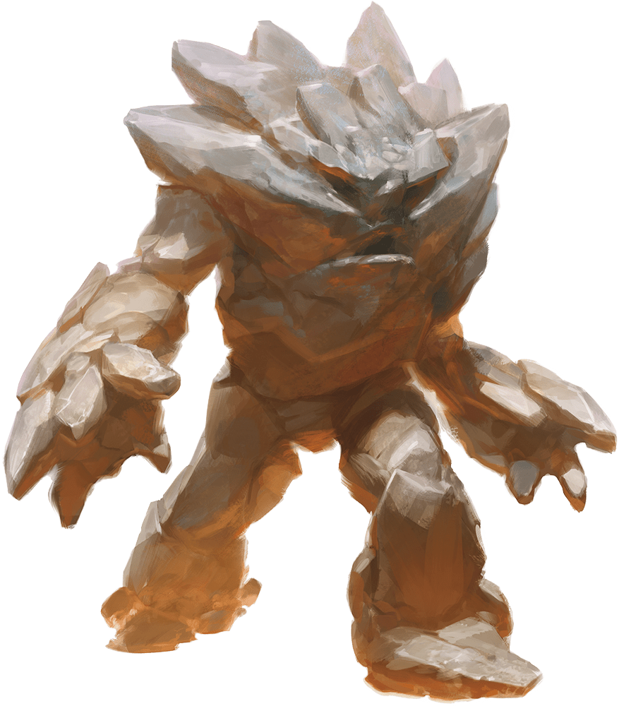

# Earth Elemental

Armor Class
17
(natural armor)

Hit Points
126
(12d10 + 60)

Speed
30 ft., burrow 30 ft.

STR

20
(+5)

DEX

8
(-1)

CON

20
(+5)

INT

5
(-3)

WIS

10
(+0)

CHA

5
(-3)

Damage Vulnerabilities
Thunder

Damage Resistances
Bludgeoning, Piercing, and Slashing from Nonmagical Attacks

Damage Immunities
Poison

Condition Immunities
Exhaustion, Paralyzed, Petrified, Poisoned, Unconscious

Senses
Darkvision 60 ft., Tremorsense 60 ft., Passive Perception 10

Languages
Terran

Challenge
5 (1,800 XP)

Proficiency Bonus
+3

## Traits

* **Earth Glide.** The elemental can burrow through nonmagical, unworked earth and stone. While doing so, the elemental doesn't disturb the material it moves through.

* **Siege Monster.** The elemental deals double damage to objects and structures.

## Actions

* **Multiattack.** The elemental makes two slam attacks.

* **Slam.** *Melee Weapon Attack:* +8 to hit, reach 10 ft., one target.

*Hit:*14 (2d8 + 5) bludgeoning damage.

### Description

An earth elemental plods forward like a walking hill, club-like arms of jagged stone swinging at its sides. Its head and body consist of dirt and stone, occasionally set with chunks of metal, gems, and bright minerals.