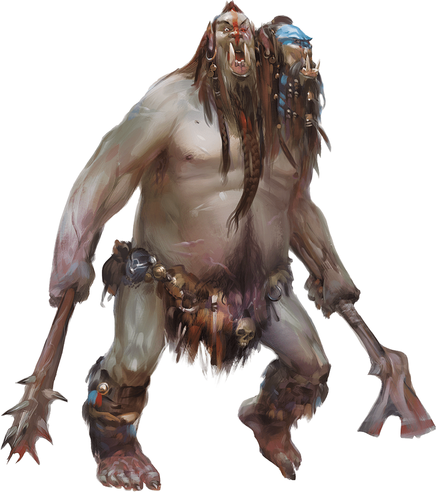

# Ettin

Armor Class
12
(natural armor)

Hit Points
85
(10d10 + 30)

Speed
40 ft.

STR

21
(+5)

DEX

8
(-1)

CON

17
(+3)

INT

6
(-2)

WIS

10
(+0)

CHA

8
(-1)

Skills
Perception +4

Senses
Darkvision 60 ft., Passive Perception 14

Languages
Giant, Orc

Challenge
4 (1,100 XP)

Proficiency Bonus
+2

## Traits

* **Two Heads.** The ettin has advantage on Wisdom (Perception) checks and on saving throws against being blinded, charmed, deafened, frightened, stunned, and knocked unconscious.

* **Wakeful.** When one of the ettin’s heads is asleep, its other head is awake.

## Actions

* **Multiattack.** The ettin makes two attacks: one with its battleaxe and one with its morningstar.

* **Battleaxe.** *Melee Weapon Attack:* +7 to hit, reach 5 ft., one target.

*Hit:*14 (2d8 + 5) slashing damage.

* **Morningstar.** *Melee Weapon Attack:* +7 to hit, reach 5 ft., one target.

*Hit:*14 (2d8 + 5) piercing damage.