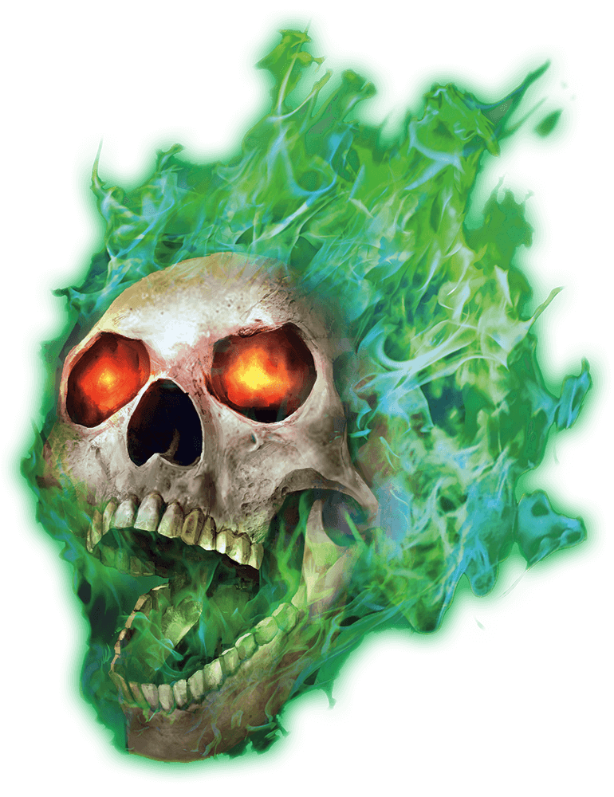

# Flameskull

## Traits

* **Illumination.** The flameskull sheds either dim light in a 15-foot radius, or bright light in a 15-foot radius and dim light for an additional 15 feet. It can switch between the options as an action.

* Magic Resistance. *The flameskull has advantage on saving throws against spells and other magical effects.

* **Rejuvenation.** If the flameskull is destroyed, it regains all its hit points in 1 hour unless holy water is sprinkled on its remains or a dispel magic or remove curse spell is cast on them.

* **Spellcasting.** The flameskull is a 5th-level spellcaster. Its spellcasting ability is Intelligence (spell save DC 13, +5 to hit with spell attacks). It requires no somatic or material components to cast its spells. The flameskull has the following wizard spells prepared:

Cantrip (at will): mage hand

1st level (3 slots): magic missile, shield

2nd level (2 slots): blur, flaming sphere

3rd level (1 slot): fireball

## Actions

** Multiattack.** The flameskull uses Fire Ray twice.

* **Fire Ray.** *Ranged Spell Attack:* +5 to hit, range 30 ft., one target.

*Hit:*10 (3d6) fire damage.

### Description

Blazing green flames and mad, echoing laughter surround an undead flameskull. This disembodied skull blasts foes with fiery rays from its eyes and dreadful spells called up from the dark recesses of its memory.