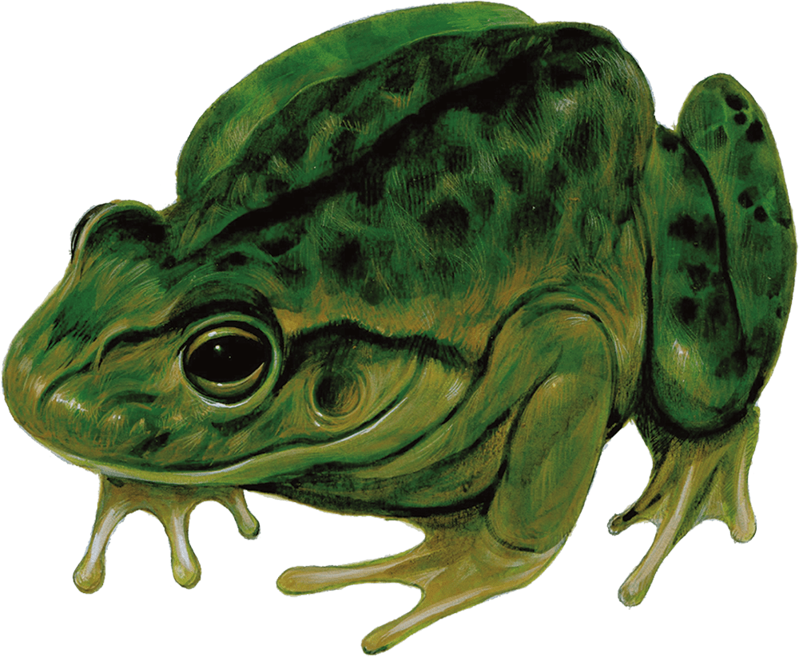

# Frog

Armor Class
11

Hit Points
1
(1d4 - 1)

Speed
20 ft., swim 20 ft.

STR

1
(-5)

DEX

13
(+1)

CON

8
(-1)

INT

1
(-5)

WIS

8
(-1)

CHA

3
(-4)

Skills
Perception +1, Stealth +3

Senses
Darkvision 30 ft., Passive Perception 11

Languages
None

Challenge
0 (10 XP)

Proficiency Bonus
+2

## Traits

* **Amphibious.** The frog can breathe air and water.

* **Standing Leap.** The frog’s Long Jump is up to 10 feet and its High Jump is up to 5 feet with or without a running start.

## Actions

* **Bite.** *Melee Attack Roll:* +3, reach 5 ft.

*1 Piercing damage.*

*Hit:*