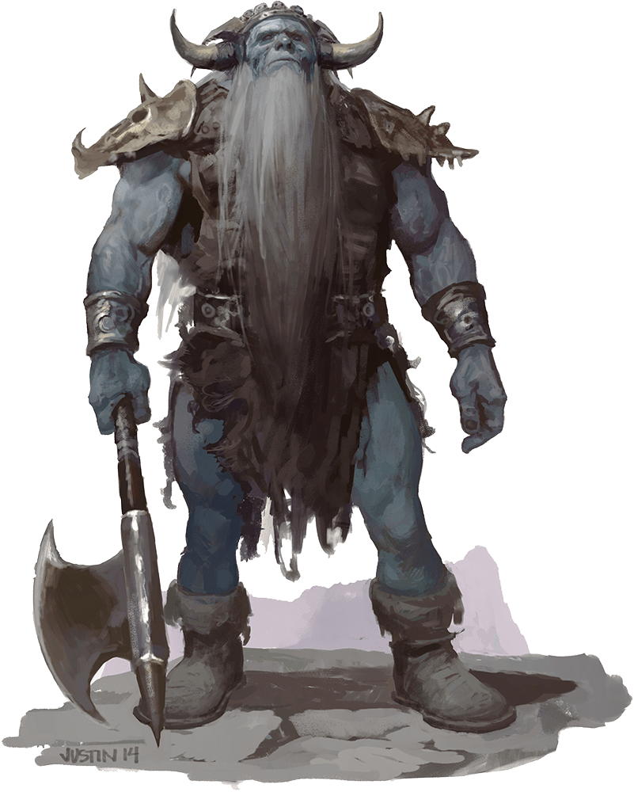

# Frost Giant

Armor Class
15
(patchwork armor)

Hit Points
138
(12d12 + 60)

Speed
40 ft.

STR

23
(+6)

DEX

9
(-1)

CON

21
(+5)

INT

9
(-1)

WIS

10
(+0)

CHA

12
(+1)

Saving Throws
CON +8, WIS +3, CHA +4

Skills
Athletics +9, Perception +3

Damage Immunities
Cold

Senses
Passive Perception 13

Languages
Giant

Challenge
8 (3,900 XP)

Proficiency Bonus
+3

## Actions

* **Multiattack.** The giant makes two greataxe attacks.

* **Greataxe.** *Melee Weapon Attack:* +9 to hit, reach 10 ft., one target.

*Hit:*25 (3d12 + 6) slashing damage.

* **Rock.** *Ranged Weapon Attack:* +9 to hit, range 60/240 ft., one target.

*Hit:*28 (4d10 + 6) bludgeoning damage.

### Description

Frost giants are creatures of ice and snow, with hair and beards of pale white or light blue, and flesh as blue as glacial ice. They respect only brute strength and skill in battle.