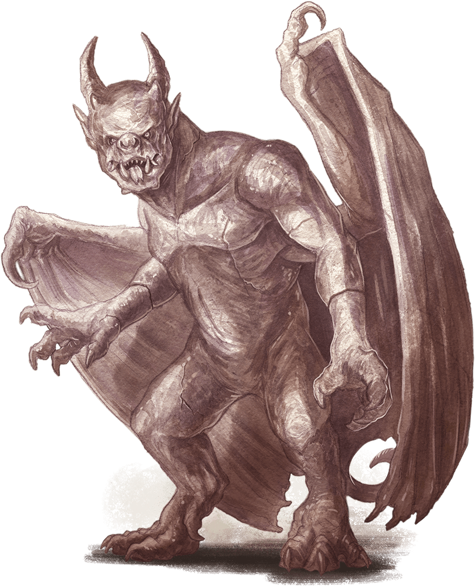

# Gargoyle

Armor Class
15
(natural armor)

Hit Points
52
(7d8 + 21)

Speed
30 ft., fly 60 ft.

STR

15
(+2)

DEX

11
(+0)

CON

16
(+3)

INT

6
(-2)

WIS

11
(+0)

CHA

7
(-2)

Damage Resistances
Bludgeoning, Piercing, and Slashing from Nonmagical Attacks that aren't Adamantine

Damage Immunities
Poison

Condition Immunities
Exhaustion, Petrified, Poisoned

Senses
Darkvision 60 ft., Passive Perception 10

Languages
Terran

Challenge
2 (450 XP)

Proficiency Bonus
+2

## Traits

* **False Appearance.** While the gargoyle remains motionless, it is indistinguishable from an inanimate statue.

## Actions

* **Multiattack.** The gargoyle makes two attacks: one with its bite and one with its claws.

* **Bite.** *Melee Weapon Attack:* +4 to hit, reach 5 ft., one target.

*Hit:*5 (1d6 + 2) piercing damage.

* **Claws.** *Melee Weapon Attack:* +4 to hit, reach 5 ft., one target.

*Hit:*5 (1d6 + 2) slashing damage.

### Description

These malevolent creatures of elemental earth resemble grotesque, fiendish statues. A gargoyle lurks among masonry and ruins, delighting in the terror it creates when it breaks from its suspended pose.