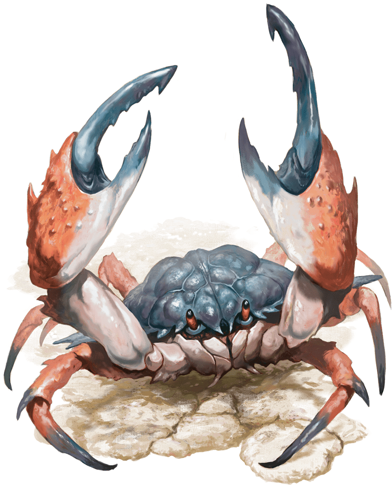

# Giant Crab

Armor Class
15

Hit Points
13
(3d8)

Speed
30 ft., swim 30 ft.

STR

13
(+1)

DEX

13
(+1)

CON

11
(+0)

INT

1
(-5)

WIS

9
(-1)

CHA

3
(-4)

Skills
Stealth +3

Senses
Blindsight 30 ft., Passive Perception 9

Languages
None

Challenge
1/8 (25 XP)

Proficiency Bonus
+2

## Traits

* Amphibious. *The crab can breathe air and water.

## Actions

* **Claw.** *Melee Attack Roll:* +3, reach 5 ft.

*4 (1d6 + 1) Bludgeoning damage. If the target is Medium or smaller, it has the Grappled condition (escape DC 11). The crab has two claws, each of which can grapple one target.*

*Hit:*