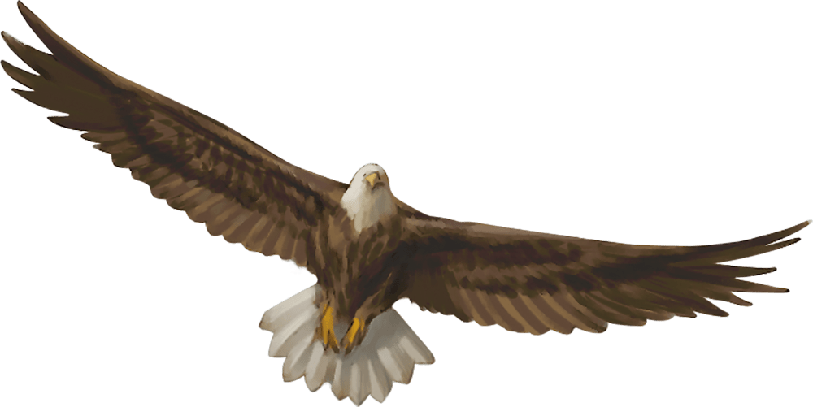

# Giant Eagle

Armor Class
13

Hit Points
26
(4d10 + 4)

Speed
10 ft., fly 80 ft.

STR

16
(+3)

DEX

17
(+3)

CON

13
(+1)

INT

8
(-1)

WIS

14
(+2)

CHA

10
(+0)

Skills
Perception +4

Senses
Passive Perception 14

Languages
Giant Eagle , understands Common and Auran but can't speak them

Challenge
1 (200 XP)

Proficiency Bonus
+2

## Traits

* **Keen Sight.** The eagle has advantage on Wisdom (Perception) checks that rely on sight.

## Actions

* **Multiattack.** The eagle makes two attacks: one with its beak and one with its talons.

* **Beak.** *Melee Weapon Attack:* +5 to hit, reach 5 ft., one target.

*Hit:*6 (1d6 + 3) piercing damage.

* **Talons.** *Melee Weapon Attack:* +5 to hit, reach 5 ft., one target.

*Hit:*10 (2d6 + 3) slashing damage.

### Description

A giant eagle is a noble creature that speaks its own language and understands speech in the Common tongue. A mated pair of giant eagles typically has up to four eggs or young in their nest (treat the young as normal eagles).