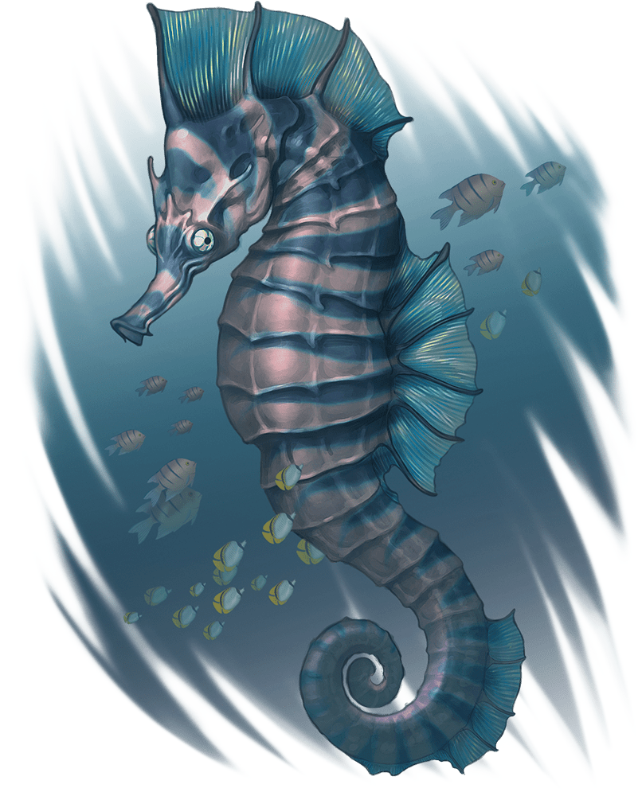

# Giant Seahorse

Armor Class
14

Hit Points
16
(3d10)

Speed
5 ft., swim 40 ft.

STR

15
(+2)

DEX

12
(+1)

CON

11
(+0)

INT

2
(-4)

WIS

12
(+1)

CHA

5
(-3)

Senses
Passive Perception 11

Languages
None

Challenge
1/2 (100 XP)

Proficiency Bonus
+2

## Traits

** Water Breathing. **The seahorse can breathe only underwater.

## Actions

* **Ram.** *Melee Attack Roll:* +4, reach 5 ft.

*9 (2d6 + 2) Bludgeoning damage, or the seahorse deals 11 (2d8 + 2) Bludgeoning damage if it moved at least 20 feet straight toward the target immediately before the hit.*

*Hit:*## Bonus Actions

* Bubble Dash. *While underwater, the seahorse moves up to half its Swim Speed without provoking Opportunity Attacks.