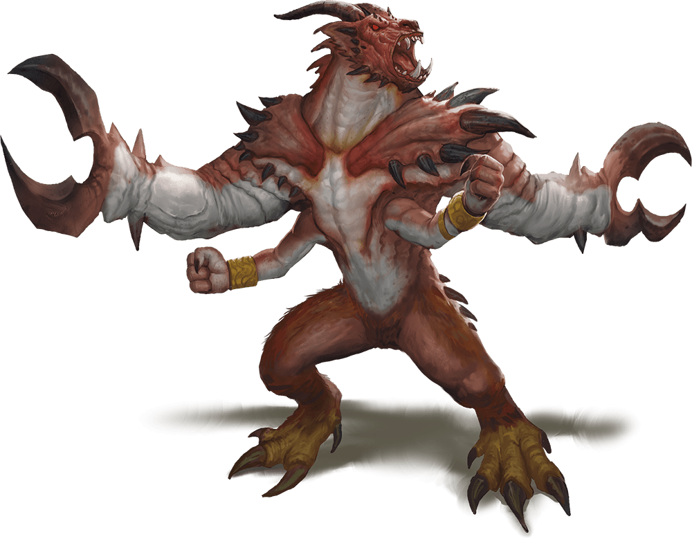

# Glabrezu

## Traits

* **Innate Spellcasting.** The glabrezu's spellcasting ability is Intelligence (spell save DC 16). The glabrezu can innately cast the following spells, requiring no material components:

At will: darkness, detect magic, dispel magic

1/day each: confusion, fly, power word stun

* **Magic Resistance.** The glabrezu has advantage on saving throws against spells and other magical effects.

## Actions

* **Multiattack.** The glabrezu makes four attacks: two with its pincers and two with its fists. Alternatively, it makes two attacks with its pincers and casts one spell.

* **Pincer.** *Melee Weapon Attack:* +9 to hit, reach 10 ft., one target.

*Hit:*16 (2d10 + 5) bludgeoning damage. If the target is a Medium or smaller creature, it is grappled (escape DC 15). The glabrezu has two pincers, each of which can grapple only one target.

* **Fist.** *Melee Weapon Attack:* +9 to hit, reach 5 ft., one target.

*Hit:*7 (2d4 + 2) bludgeoning damage.