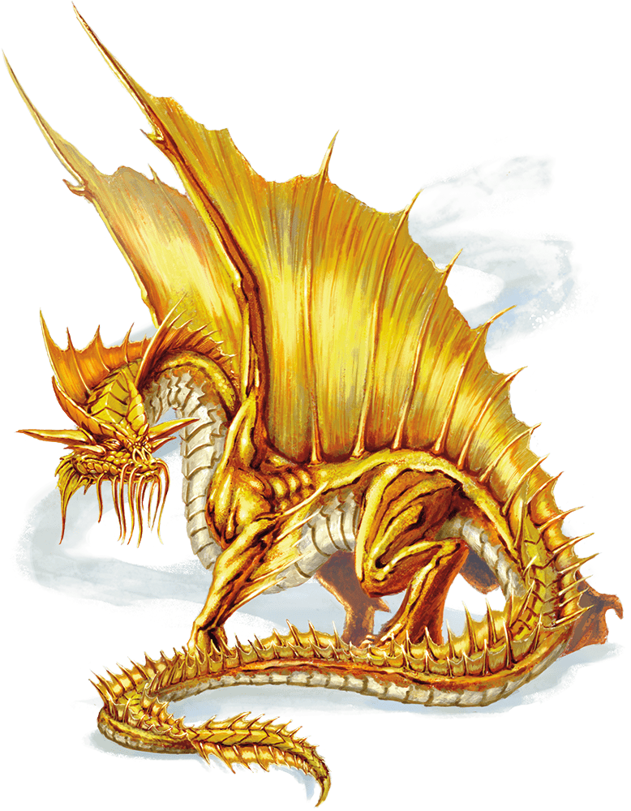

# Gold Dragon Wyrmling

## Traits

* Amphibious. *The dragon can breathe air and water.

## Actions

**Bite. ***Melee Weapon Attack*: +6 to hit, reach 5 ft., one target. *Hit*: 9 (1d10 + 4) piercing damage.

* **Breath Weapons (Recharge 5–6).** The dragon uses one of the following breath weapons.

* Fire Breath. *The dragon exhales fire in a 15-foot cone. Each creature in that area must make a DC 13 Dexterity saving throw, taking 22 (4d10) fire damage on a failed save, or half as much damage on a successful one.

* **Weakening Breath.** The dragon exhales gas in a 15-foot cone. Each creature in that area must succeed on a DC 13 Strength saving throw or have disadvantage on Strength-based attack rolls, Strength checks, and Strength saving throws for 1 minute. A creature can repeat the saving throw at the end of each of its turns, ending the effect on itself on a success.