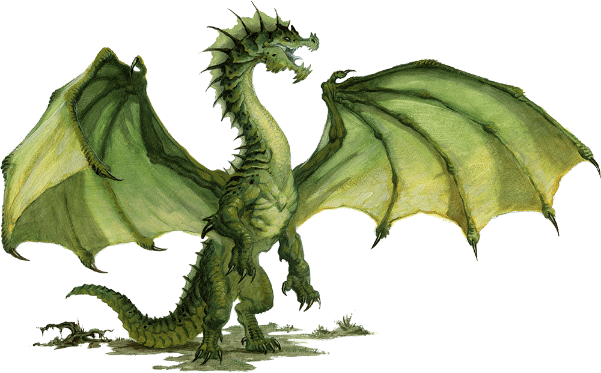

# Green Dragon Wyrmling

Armor Class
17
(natural armor)

Hit Points
38
(7d8 + 7)

Speed
30 ft., fly 60 ft., swim 30 ft.

STR

15
(+2)

DEX

12
(+1)

CON

13
(+1)

INT

14
(+2)

WIS

11
(+0)

CHA

13
(+1)

Saving Throws
DEX +3, CON +3, WIS +2, CHA +3

Skills
Perception +4, Stealth +3

Damage Immunities
Poison

Condition Immunities
Poisoned

Senses
Blindsight 10 ft., Darkvision 60 ft., Passive Perception 14

Languages
Draconic

Challenge
2 (450 XP)

Proficiency Bonus
+2

## Traits

* **Amphibious.** The dragon can breathe air and water.

## Actions

* **Bite.** *Melee Weapon Attack:* +4 to hit, reach 5 ft., one target.

*Hit:*7 (1d10 + 2) piercing damage plus 3 (1d6) poison damage.

* **Poison Breath (Recharge 5–6).** The dragon exhales poisonous gas in a 15-foot cone. Each creature in that area must make a DC 11 Constitution saving throw, taking 21 (6d6) poison damage on a failed save, or half as much damage on a successful one.

### Description

The most cunning and treacherous of true dragons, green dragons use misdirection and trickery to get the upper hand against their enemies. A green dragon is recognized by the crest that begins near its eyes and continues down its spine, reaching full height just behind the skull.