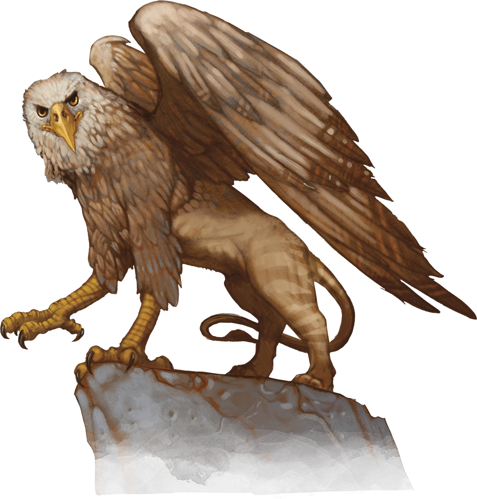

# Griffon

Armor Class
12

Hit Points
59
(7d10 + 21)

Speed
30 ft., fly 80 ft.

STR

18
(+4)

DEX

15
(+2)

CON

16
(+3)

INT

2
(-4)

WIS

13
(+1)

CHA

8
(-1)

Skills
Perception +5

Senses
Darkvision 60 ft., Passive Perception 15

Languages
--

Challenge
2 (450 XP)

Proficiency Bonus
+2

## Traits

* **Keen Sight.** The griffon has advantage on Wisdom (Perception) checks that rely on sight.

## Actions

* **Multiattack.** The griffon makes two attacks: one with its beak and one with its claws.

* **Beak.** *Melee Weapon Attack:* +6 to hit, reach 5 ft., one target.

*Hit:*8 (1d8 + 4) piercing damage.

* **Claws.** *Melee Weapon Attack:* +6 to hit, reach 5 ft., one target.

*Hit:*11 (2d6 + 4) slashing damage.

### Description

A griffon is a ferocious avian carnivore with the muscular body of a lion and the head, forelegs, and wings of an eagle.