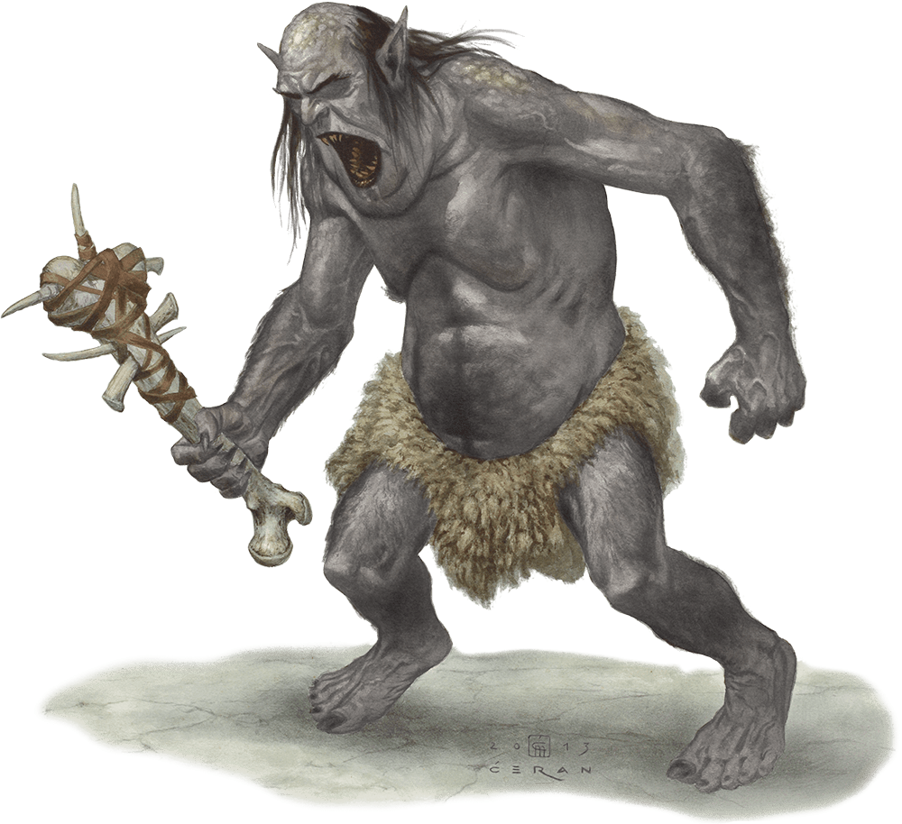

# Grimlock

Armor Class
11

Hit Points
11
(2d8 + 2)

Speed
30 ft.

STR

16
(+3)

DEX

12
(+1)

CON

12
(+1)

INT

9
(-1)

WIS

8
(-1)

CHA

6
(-2)

Skills
Athletics +5, Perception +3, Stealth +3

Condition Immunities
Blinded

Senses
Blindsight 30 ft. or 10 ft. while deafened (blind beyond this radius), Passive Perception 13

Languages
Undercommon

Challenge
1/4 (50 XP)

Proficiency Bonus
+2

## Traits

* Blind Senses*. The grimlock can't use its blindsight while deafened and unable to smell.

* **Keen Hearing and Smell.** The grimlock has advantage on Wisdom (Perception) checks that rely on hearing or smell.

* **Stone Camouflage.** The grimlock has advantage on Dexterity (Stealth) checks made to hide in rocky terrain.

## Actions

* **Spiked Bone Club.** *Melee Weapon Attack:* +5 to hit, reach 5 ft., one target.

*Hit:*5 (1d4 + 3) bludgeoning damage plus 2 (1d4) piercing damage.