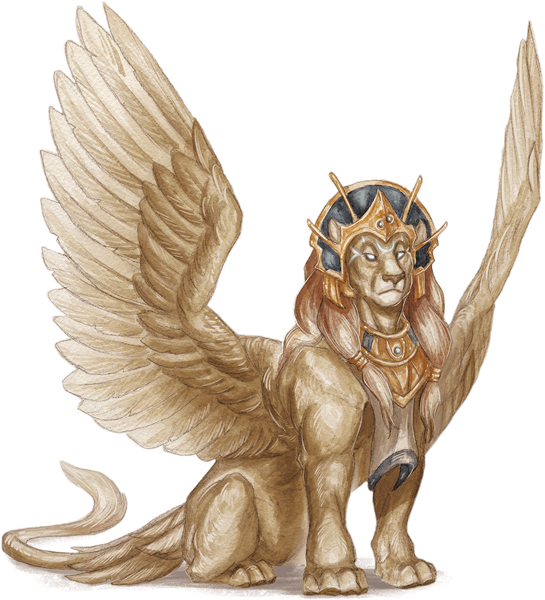

# Gynosphinx

## Traits

* **Inscrutable.** The sphinx is immune to any effect that would sense its emotions or read its thoughts, as well as any divination spell that it refuses. Wisdom (Insight) checks made to ascertain the sphinx's intentions or sincerity have disadvantage.

* **Magic Weapons.** The sphinx's weapon attacks are magical.

* **Spellcasting.** The sphinx is a 9th-level spellcaster. Its spellcasting ability is Intelligence (spell save DC 16, +8 to hit with spell attacks). It requires no material components to cast its spells. The sphinx has the following wizard spells prepared:

Cantrips (at will): mage hand, minor illusion, prestidigitation

1st level (4 slots): detect magic, identify, shield

2nd level (3 slots): darkness, locate object, suggestion

3rd level (3 slots): dispel magic, remove curse, tongues

4th level (3 slots): banishment, greater invisibility

5th level (1 slot): legend lore

## Actions

* **Multiattack.** The sphinx makes two claw attacks.

* **Claw.** *Melee Weapon Attack:* +8 to hit, reach 5 ft., one target.

*Hit:*13 (2d8 + 4) slashing damage.

## Legendary Actions

The sphinx can take 3 legendary actions, choosing from the options below. Only one legendary action option can be used at a time and only at the end of another creature's turn. The sphinx regains spent legendary actions at the start of its turn.

**Claw Attack.** The sphinx makes one claw attack.

**Teleport (Costs 2 Actions).** The sphinx magically teleports, along with any equipment it is wearing or carrying, up to 120 feet to an unoccupied space it can see.

**Cast a Spell (Costs 3 Actions).** The sphinx casts a spell from its list of prepared spells, using a spell slot as normal.

### A Sphinx’s Lair

A sphinx presides over an ancient temple, sepulcher, or vault, within which are hidden divine secrets and treasures beyond the reach of mortals.

#### Lair Actions

On initiative count 20 (losing initiative ties), the sphinx can take a lair action to cause one of the following magical effects; the sphinx can’t use an effect again until it finishes a short or long rest:

- The flow of time is altered such that every creature in the lair must reroll initiative. The sphinx can choose not to reroll.
- The effects of time are altered such that every creature in the lair must succeed on a DC 15 Constitution saving throw or become 1d20 years older or younger (the sphinx’s choice), but never any younger than 1 year old. A greater restoration spell can restore a creature’s age to normal.
- The flow of time within the lair is altered such that everything within moves up to 10 years forward or backward (sphinx’s choice). Only the sphinx is immediately aware of the time change. A wish spell can return the caster and up to seven other creatures designated by the caster to their normal time.
- The sphinx shifts itself and up to seven other creatures it can see within in its lair to another plane of existence. Once outside its lair, the sphinx can’t use lair actions, but it can return to its lair as a bonus action on its turn, taking up to seven creatures with it.