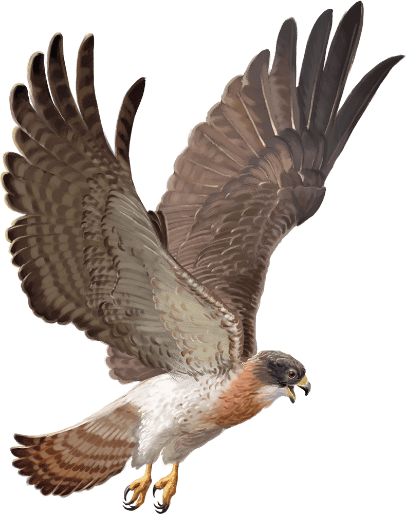

# Hawk

Armor Class
13

Hit Points
1
(1d4 - 1)

Speed
10 ft., fly 60 ft.

STR

5
(-3)

DEX

16
(+3)

CON

8
(-1)

INT

2
(-4)

WIS

14
(+2)

CHA

6
(-2)

Skills
Perception +6

Senses
Passive Perception 16

Languages
None

Challenge
0 (10 XP)

Proficiency Bonus
+2

## Actions

* **Talons.** *Melee Attack Roll:* +5, reach 5 ft.

*Hit:*1 Slashing damage.