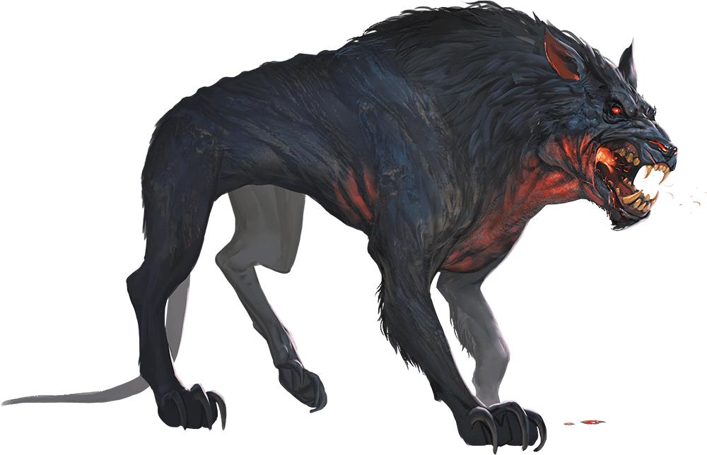

# Hell Hound

## Traits

* **Keen Hearing and Smell.** The hound has advantage on Wisdom (Perception) checks that rely on hearing or smell.

* **Pack Tactics.** The hound has advantage on an attack roll against a creature if at least one of the hound's allies is within 5 feet of the creature and the ally isn't incapacitated.

## Actions

* **Bite.** *Melee Weapon Attack:* +5 to hit, reach 5 ft., one target.

*Hit:*7 (1d8 + 3) piercing damage plus 7 (2d6) fire damage.

* **Fire Breath (Recharge 5–6).** The hound exhales fire in a 15-foot cone. Each creature in that area must make a DC 12 Dexterity saving throw, taking 21 (6d6) fire damage on a failed save, or half as much damage on a successful one.

### Description

Fire-breathing fiends that take the form of powerful dogs, hell hounds commonly serve evil creatures that use them as guard animals and companions.