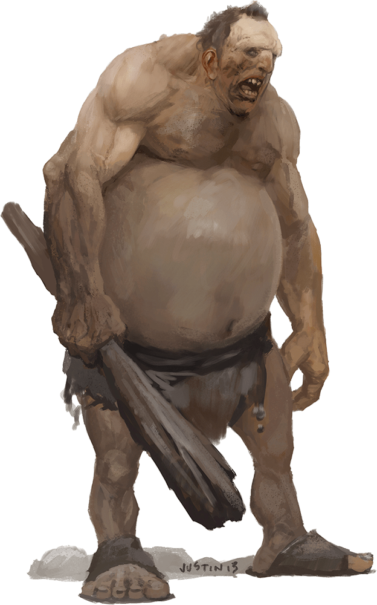

# Hill Giant

Armor Class
13
(natural armor)

Hit Points
105
(10d12 + 40)

Speed
40 ft.

STR

21
(+5)

DEX

8
(-1)

CON

19
(+4)

INT

5
(-3)

WIS

9
(-1)

CHA

6
(-2)

Skills
Perception +2

Senses
Passive Perception 12

Languages
Giant

Challenge
5 (1,800 XP)

Proficiency Bonus
+3

## Actions

* **Multiattack.** The giant makes two greatclub attacks.

* **Greatclub.** *Melee Weapon Attack:* +8 to hit, reach 10 ft., one target.

*Hit:*18 (3d8 + 5) bludgeoning damage.

* **Rock.** *Ranged Weapon Attack:* +8 to hit, range 60/240 ft., one target.

*Hit:*21 (3d10 + 5) bludgeoning damage.

### Description

Hill giants are selfish brutes that hunt and raid in constant search of food. Their skins are tan from lives spent beneath the sun, and their weapons are uprooted trees and rocks pulled from the earth.